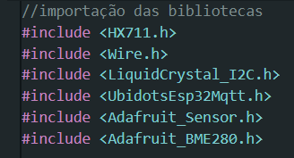

# Inteli - Instituto de Tecnologia e Liderança 

 

# Iron

<figure>
  <figcaption style="text-align: center;"></figcaption>
  
  <figcaption style="text-align: center;">Fonte: Autoria própria.</figcaption>
</figure>

## 👨‍🎓 Integrantes: 
- <a href="https://www.linkedin.com/in/ana-luisa-goes-barbosa/">Ana Luisa Goes Barbosa</a>
- <a href="https://www.linkedin.com/in/gustavo-machado-esteves-453b81248/">Gustavo Machado Esteves</a>
- <a href="https://www.linkedin.com/in/heitorprudente/">Heitor Prudente</a> 
- <a href="https://www.linkedin.com/in/henrique-cox-4644bb270/">Henrique Cox</a> 
- <a href="https://www.linkedin.com/in/luiz-fernando-villaça-leão-930568271/">Luiz Fernando Villaça Leão</a>
- <a href="https://www.linkedin.com/in/luiza-rubim/">Luiza Rubim</a> 

## 👩‍🏫 Professores:
### Orientador(a) 
- <a href="https://www.linkedin.com/in/juliastateri/">Julia Stateri</a>
### Instrutores
- <a href="https://www.linkedin.com/in/leonardobontempo/">Leonardo Bontempo </a>
- <a href="https://www.linkedin.com/in/sergio-venancio-a509b342/">Sergio Venancio</a> 
- <a href="https://www.linkedin.com/in/ricardo-jos%C3%A9-missori/">Ricardo José Missori</a> 
- <a href="https://www.linkedin.com/in/flaviomarquesazevedo/">Flavio Marques Azevedo</a>
- <a href="https://www.linkedin.com/in/egondaxbacher/">Egon Ferreira Daxbacher</a> 
- <a href="https://www.linkedin.com/in/michele-bazana-de-souza-69b77763/">Michele Bazana de Souza</a>

## 📜 Descrição

&emsp;&emsp;A turma tem como parceiro o IPT, Instituto de Pesquisas Tecnológicas, uma empresa estatal brasileira que oferece soluções tecnológicas e inovadoras para diversos setores da sociedade. O IPT possui uma seção de obras civis que se dedica a vários aspectos da engenharia civil, incluindo pesquisa, consultoria e serviços especializados relacionados à construção, materiais de construção, estruturas, geotecnia, entre outros.
O projeto visa desenvolver um protótipo de um condicionador de sinal capaz de medir o peso e a dilatação das estruturas de pontes e viadutos, utilizando a plataforma Arduino/ESP32. O dispositivo, chamado de Eagle, tem como objetivo facilitar a manutenção preventiva e a detecção de possíveis problemas nas estruturas monitoradas, reduzindo os custos e os riscos associados à utilização de equipamentos mais caros e complexos.

LINK PARA VÍDEO DA SOLUÇÃO FINAL:
<a href="https://youtu.be/Una2pWZ7FMA">Vídeo Solução Final </a>

## 📁 Estrutura de pastas

&emsp;&emsp;Dentre os arquivos e pastas presentes na raiz do projeto, definem-se:

- <b>assets</b>: aqui estão os arquivos relacionados a parte gráfica do projeto, ou seja, as imagens e vídeos que os representam (O logo do grupo pode ser adicionado nesta pasta).

- <b>document</b>: aqui estão todos os documentos do projeto, incluindo o manual de instruções (se aplicável). Há também uma pasta denominada <b>outros</b> onde estão presentes outros documentos complementares.

- <b>src</b>: Todo o código fonte criado para o desenvolvimento do projeto, incluindo firmware, notebooks, backend e frontend, se aplicáveis.

- <b>README.md</b>: arquivo que serve como guia e explicação geral sobre o projeto (o mesmo que você está lendo agora).

## 🔧 Instalação

&emsp;&emsp;Pré-Requisitos:
- Arduíno IDE: Versão 2.2.1
- Ubidots: (https://ubidots.com/)

&emsp;&emsp;Instalação das bibliotecas:
<figure>
  
</figure>

&emsp;&emsp;LINK MANUAL DE INSTRUÇÕES: (https://docs.google.com/document/d/1ER--kwJFhdNPNf6gCanfS6-BQ9GPNWoj/edit?usp=sharing&ouid=109806054179371943488&rtpof=true&sd=true)

## 🗃 Histórico de lançamentos

* 0.5.0 - 21/12/2023
    * Protótipo final do projeto;
    * Versão final do código do projeto;
    * Arquitetura refinada da solução;
    * Manual de instrução revisada.
* 0.4.0 - 08/12/2023
    * Desenvolvimento do projeto (online);
    * Código do projeto na documentação;
    * Aprimoramento da arquitetura do protótipo;
    * Desenvolvimento do manual de instrução;
    * Avaliação da possibilidade de descarte.
* 0.3.0 - 24/11/2023
    * Comunicação entre condicionadores de sinais com MQTT e I2C;
    * Explicação da metodologia alinhada ao projeto;
    * Arquitetura da solução.
* 0.2.0 - 10/11/2023
    * Desenvolvimento do desenho esquemático e wireframes;
    * Protótipo físico do projeto;
    * Requisitos não funcionais.
* 0.1.0 - 27/10/2023
    * Desenvolvimento da parte de negócios;
    * Fundamentos de experiência do usuário;
    * Requisitos Funcionais;
    * Protótipo inicial pelo wookiwi.

## 📋 Licença/License

<a property="dct:title" rel="cc:attributionURL" href="https://github.com/2023M4T9Inteli/grupo5">Iron</a> by <a rel="cc:attributionURL dct:creator" property="cc:attributionName" href="https://github.com/InteliProjects">Inteli</a>, <a property="dct:title" rel="cc:attributionURL" href="https://www.linkedin.com/in/ana-luisa-goes-barbosa/">Ana Luisa Goes Barbosa</a>, <a property="dct:title" rel="cc:attributionURL" href="https://www.linkedin.com/in/gustavo-machado-esteves-453b81248/">Gustavo Machado Esteves</a>, <a property="dct:title" rel="cc:attributionURL" href="https://www.linkedin.com/in/heitorprudente/">Heitor Prudente</a>, <a property="dct:title" rel="cc:attributionURL" href="https://www.linkedin.com/in/henrique-cox-4644bb270/">Henrique Cox</a>, <a property="dct:title" rel="cc:attributionURL" href="https://www.linkedin.com/in/luiz-fernando-villaça-leão-930568271/">Luiz Fernando Villaça Leão</a>, <a property="dct:title" rel="cc:attributionURL" href="https://www.linkedin.com/in/luiza-rubim/">Luiza Rubim</a> is licensed under <a href="http://creativecommons.org/licenses/by/4.0/?ref=chooser-v1" target="_blank" rel="license noopener noreferrer" style="display:inline-block;">Attribution 4.0 International</a>.

