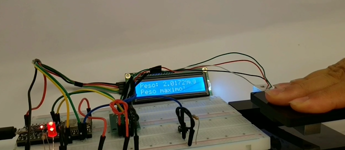

# Documentação IoTDoc - Módulo 4 - Inteli

## Grupo Iron
#### Ana Luisa Goes Barbosa, Gustavo Machado Esteves, Heitor Elias Prudente, Henrique Cox Cabral Oliveira de Moura, Luiz Fernando Villaça Leão, Luiza Souza Rubim

## Sumário

[1. Introdução](#c1)

[2. Metodologia](#c2)

[3. Desenvolvimento e Resultados](#c3)

[4. Possibilidades de Descarte](#c4)

[5. Conclusões e Recomendações](#c5)

[6. Referências](#c6)

 

# 1. Introdução 

&emsp;&emsp; O IPT, Instituto de Pesquisas Tecnológicas, é uma empresa estatal brasileira, fundada em 1899 e sediada em São Paulo e apresenta um forte posicionamento no mercado. Sua reputação baseia-se na sua capacidade de fornecer soluções tecnológicas e inovadoras, bem como serviços de consultoria de alta qualidade, para atender às necessidades específicas de empresas, indústrias e setores governamentais.[1]

&emsp;&emsp; A seção de obras civis do IPT se concentra em vários aspectos do campo da engenharia civil, incluindo pesquisa, consultoria e serviços especializados relacionados à construção, materiais de construção, estruturas, geotecnia, entre outros. Essa seção geralmente se envolve em uma variedade de projetos e atividades, incluindo o desenvolvimento e a avaliação de materiais de construção, a análise de estruturas e fundações, a inspeção de edifícios e infraestrutura, além de fornecer consultoria em diversas áreas da engenharia civil.[2]

&emsp;&emsp; No momento, para monitorar estruturas como pontes e viadutos, o IPT utiliza-se de um dispositivo capaz de medir o peso e dilatação metálica e que tem alto custo no mercado. Nesse sentido, a utilização e a manutenção desse equipamento tornam-se menos viáveis, fazendo com que esse processo seja menos acessível, o que levou o IPT a buscar o Inteli.[3]

## 1.1 Objetivos

### 1.1.1 Objetivo geral
&emsp;&emsp; Concluí-se, a partir da leitura da TAPI[3], que o IPT busca baratear o equipamento utilizado para torná-lo mais acessível e fazer com que sua utilização se torne viável no cotidiano. Nesse sentido, é possível apontar o seguinte objetivo com o geral do projeto: o objetivo do parceiro é:

-  Criação de um protótipo que seja capaz de medir tanto o peso quanto a dilatação metálica das estruturas.

Com isso, é possível ter uma maior noção quanto a danos estruturais e facilitar que possíveis problemas sejam resolvidos antes mesmo de ocorrerem, por meio da manutenção preventiva. 

### 1.1.2 Objetivos específicos
Para alcançar o objetivo geral, o IPT busca concluir os seguintes objetivos específicos:

- Criação de um protótipo funcional que seja capaz de receber dados de células de carga em configuração de ponte completa.
- Fazer com que o protótipo armazene dados localmente ou em nuvem, evitando perdas em caso de quedas de energia.
- Aplicação dos dados fornecidos em tempo real.
- Redução da quantidade de cabos utilizados, visando facilitar a instalação do equipamento.
- Implementação de um sistema de proteção contra fatores externos, como temperatura e clima.

## 1.2 Proposta da solução

&emsp;&emsp; A proposta de solução, batizada com o nome Eagle, envolve o desenvolvimento de um protótipo robusto e acessível, utilizando a plataforma Arduino IDE e o microcontrolador ESP32, capaz de receber e armazenar dados de Células de Carga em configuração de ponte completa. Além disso, pretende-se implementar um sistema de transmissão em tempo real dos dados para facilitar a análise e a detecção precoce de possíveis problemas nas estruturas monitoradas. A solução também visa simplificar a instalação e reduzir a dependência de cabos, garantindo maior praticidade no uso diário. Por fim, a proposta inclui a aplicação de medidas de proteção para garantir a durabilidade e a confiabilidade do sistema em diferentes condições ambientais.

## 1.3 Justificativa

&emsp;&emsp; A solução Eagle apresenta um potencial significativo para revolucionar o monitoramento de estruturas, tornando-o mais acessível e prático para o cotidiano. Ao reduzir a dependência de cabos e fornecer transmissão de dados em tempo real, nosso sistema facilitará a detecção preventiva de danos estruturais, permitindo intervenções preventivas eficazes. Além disso, a capacidade de armazenamento local e em nuvem garantirá a segurança dos dados, evitando perdas em situações de falha de energia. A solução também se destaca pela sua abordagem inovadora e pela capacidade de oferecer um monitoramento mais eficiente e econômico, contribuindo assim para a segurança e a durabilidade de diversas estruturas civis.

# 2. Metodologia 

&emsp;&emsp;A metodologia RM-ODP (Reference Model for Open Distributed System) é um conjunto de normas desenvolvido pela ISO (International Organization for Standardization) utilizado na arquitetura de sistemas para resolver problemas como a introdução de um novo sistema, a explicação do seu funcionamneto e etapas de sua evolução. Essa metodologia visa fornecer uma base conceitual para o design e a implementação de sistemas distribuídos, promovendo a interoperabilidade, a reutilização e a extensibilidade.  Ela é
composta por cinco etapas complementares, conhecidas como pontos de vista de arquitetura, para modelar diferentes aspectos de um sistema distribuído e serve para especificar o sistema, bem como as interfaces e os serviços que permitem a comunicação entre eles. Abaixo encontra-se uma explicação sobre cada uma das etapas:
- Ponto de vista empresarial: esse tópico define o conceito do projeto, visa analisar a parte de negócios focando na estrutura do projeto e o esclarecimento para o stakeholder;
- Ponto de vista da informação: descreve as informações trocadas entre o sistema, ou seja, as informações armazenadas e processadas;
- Ponto de vista computacional: são as funcionalidades que o sistema desenvolvido terá, está relacionado aos limites de negócios e projetos estabelecidos no primeiro tópico;
- Ponto de vista de engenharia: aborda as questões físicas do sistema e distribuição do sistema, tem foco na infraestrutura que o sistema terá para suportar a distribuição com outros sistemas e componentes;
- Ponto de vista de tecnologia: foco na seleção da tecnologia para a implementação do projeto desenvolvido, lida com a alocação de recursos de computação no sistema.

###### Figura 1 - RM-ODP
<figure>
  <figcaption style="text-align: center;"></figcaption>
  
  <figcaption style="text-align: center;">Fonte: <a href="https://www.researchgate.net/figure/The-five-RM-ODP-Viewpoints-and-their-dependencies_fig1_30510201">RM-ODP</a></figcaption>
</figure>

&emsp;&emsp;Conforme a figura acima demonstra, cada ponto de vista está estritamente ligado a qual etapa e qual enfoque o projeto se encontra, tendo em vista o processo construitivo de cada etapa e , ocmo as setas mostram, a interdependência de uma etapa para o prosseguimento da outra. Dessa forma, apesar de ser unidirecional, esse modelo não exclui a iteratividade do processo, uma vez que, conforme o projeto apresenta necessidades de alteração em sua visão de negócios, por exemplo, toda a estrutura seguinte deverá ser modificada seguindo a nova alteração.

&emsp;&emsp;Trazendo uma explicação da aplicação da metodologia RM-ODP ao projeto de condicionador de sinais desenvolvido em parceria com o IPT, o grupo aplicou as etapas da seguinte forma:

1. Business viewpoint (Ponto de vista empresarial): Nesta etapa há a definição e esclarecimento do escopo do projeto, bem como os objetivos, os requisitos e o alinhamento com o parceiro. Foram identificadas as oportunidades e os desafios do mercado e das tecnologias relacionadas ao IoT durante o desenvolvimento dos fundamentos de negócios, como a matriz SWOT e o Value Proposition Canvas. O grupo pôde analisar os pontos fortes e fracos do projeto e do mercado que o IPT trabalha, respectivamente:
	- O IPT é uma instituição de grande reconhecimento e fornece profissionais com diversas especializações, que ajudam no desenvolvimento do projeto;
	- Com o avanço da indústria 4.0 e das políticas de ESG, o IPT pode ter um grande desenvolvimento aplicando suas pesquisas nessas áreas;
	- Para o projeto, é possível calcular a economia dos gastos que o parceiro terá, bem como uma solução mais tecnológica e versátil;
	- O baixo uso de cabos de comunicação, o acarreta na redução dos custos, e a diminuição da complexidade da energia são outros pontos positivos que o projeto irá contribuir.

&emsp;&emsp;Os pontos fracos que o grupo pode analisar no projeto, foram os seguintes:
	- Por se tratar de uma empresa pertencente ao órgão público, o IPT fica dependente de recursos públicos para o financiamento de pesquisas e projetos;
	- Possível chance de obsolescência devido aos avanços da indústria 4.0, bem como o risco de redução dos investimentos públicos e riscos ambientais.

&emsp;&emsp;Ditos esses pontos, a visão empresarial foi realizada tendo uma análise de negócios e acertando os objetivos e limitações do projeto com o parceiro. 

2. Information viewpoint (Ponto de vista da informação): Esse ponto de vista diz respeito à troca de informações manipuladas pelo sistema, ou seja, define como os dados são organizados, acessados, manipulados e transmitidos entre os componentes distribuídos de um sistema. Esse viewpoint busca garantir a consistência e a integridade dos dados, além de especificar as regras e os formatos para a troca de informações entre diferentes partes do sistema distribuído. Tendo em vista a necessidade de alguns pontos chaves para obter um esquema de informações eficiente e seguro, foram elencados os seguintes pontos a serem analisados e desenvolvidos:
	
	- **Identificação de Requisitos de Informação:** Esse ponto destaca a forma como os dados são sitribuidos ao longo do sistema e quais as principis necessidades de informações do sistema. Isso envolve identificar quais dados são essenciais, como serão usados, quem terá acesso a eles e em que contexto serão utilizados. No caso do condicionador de sinal, os principais dados requisitados são as medidas aferidas pelos sensores, os alertas de comportamentos anômalos e informações de identificação do sensor. Assim, o desenvolvimento foi focado no fluxo e na coletagem dessas informações, além de entender como seria exibida a análise desses dados.

	- **Modelagem Conceitual:** A etapa de modelagem conceitual se mostra essencial na visão informacional do sistema para entender de forma mais prática e técnica como serão tratadas as informações em cada etapa do sistemae as relações entre cada tipo de dado. Como principal benefício, identifica-se que esse modelo ajuda a capturar a estrutura lógica dos dados e suas inter-relações, independentemente de tecnologias ou implementações específicas. Aplicando essa modelagem no projeto, busca-se a estruturação dos dados por meio da transmissão de cada condicionador diretamente na plataforma por meio de um protocolo de mensageria, e o tratamento e análise desses dados ocorrendo diretamente na plataforma de visualização e relatórios, simplificando o processo de reunião dessas informações e mitigando possíveis equívocos de centralização da informação.

	- **Garantia de Integridade e Consistência:** O ponto tratado se refere a mecanismos que garantam a integridade e consistência dos dados ao longo de várias etapas e ciclos do sistema, incluindo regras de validação, restrições de acesso e políticas de segurança. Isso assegura que a informação seja precisa, completa e protegida contra acessos não autorizados ou corrupção. Entendendo a importância dintegridade da informação, buscou-se mecanismos de segurança a ataques externos, como o uso de um broker de mensageria seguro e robusto, além de uma conexão direta à plataforma, evitando possíveis manipulações na informação e, como citado no ponto acima, reduzir erros de centralização da informação.

&emsp;&emsp;Assim, compreendendo a etapa relacionada às técnicas utilizadas para o armazenamento e processamento dos dados, tornou-se mais claro como seria realizado o fluxo entre informações armazenadas e processadas até entre os sistemas IoT. Portanto, seguiram-se os planos de realizar a comunicação por rede WiFi e alinhado aos protocolos MQTT para transmissão das informações e I2c para organização dos dados coletados. Além disso, Será utilizada a plataforma Ubidots para o processamento e entendimento dos dados vindo da célula de carga por meio de dashboards.

3. Computational viewpoint (ponto de vista computacional): Implementar o sistema seguindo as especificações dos pontos de vista, além de realizar testes, validações e integrações entre os sistemas ODP (Open Distributed System) que compõem o sistema IoT e utilização de uma linguagem específica para o sistema. Ao desenvolver o protótipo e a documentação necessária, o grupo avaliou critérios como sucesso de medida, requisitos funcionais e não funcionais seguindo critérios da norma ISO 25010 e testagem do protótipo físico. Sendo assim, o grupo avaliou que alguns pontos que podem ser levados em consideração nesse processo foram: 
	- O sistema deve suportar a coleta e transmissão de dados em larga escala, realizando testes de carga com valores próximos aos reais e por um tempo significativo;
	- O manual de instrução deve fornecer imagens claras, visando a acessibilidade e maior entendimento, é possível realizar esse teste mostrando o manual para os usuários e avaliando se eles conseguem compreender.

&emsp;&emsp;Além desses casos de requisitos não funcionais, foi realizado o entendimento dos requisitos funcionais, como:
	- O dispositivo deve enviar os dados em tempo real, mas também armazenar os dados em um dispositivo de memória interna;
	- O dispositivo deve permitir que o usuário visualize os dados coletados em um gráfico ou tabela.

4. Engineering viewpoint (ponto de vista da engenharia): A parte de engenharia envolve toda a estrutura por trás da criação do protótipo. Este viewpoint se concentra na definição da infraestrutura necessária para fornecer suporte abrangente ao sistema. 

&emsp;&emsp;A infraestrutura não se refere apenas à estrutura física, mas também inclui uma variedade de serviços que são essenciais para o funcionamento eficaz do sistema, como serviços de comunicação que permitem a interação entre diferentes componentes do sistema. Outros serviços de suporte que são vitais para o uso das aplicações podem ser serviços de gerenciamento de dados, serviços de segurança, serviços de gerenciamento de identidade e acesso, entre outros.

&emsp;&emsp;Perante o contexto existente em relação ao projeto em parceria com o IPT, a parte de engenharia envolve toda a estrutura por de trás da criação do protótipo. Ao implementar o protótipo nos locais de interesse do parceiro, como em pontes, por exemplo, o sistema terá que funcionar corretamente, proporcionando serviços de comunicação que podem realizar trocas de dados sobre a deformação e a dilatação de pontes, que são dados importantes para o parceiro. Este serviço deve não só facilitar o uso da aplicação, mas também garantir que o sistema possa operar de maneira segura e resistente a falhas. Existe a probabilidade, por exemplo, de ocorrerem situações climáticas adversas durante a utilização do protótipo em pontes, então é importante não só que o aparelho seja resistente fisicamente nessas condições, mas também que consiga realizar a transmissão de dados nesses cenários.

5. Technology viewpoint (Ponto de vista da tecnologia): O ponto de vista da tecnologia representa os componentes de hardware e software que compõem o sistema, bem como a tecnologia de comunicação que permite a conexão entre esses componentes e a implementação efetiva do sistema.

&emsp;&emsp;Os componentes de hardware são os dispositivos físicos que compõem o sistema. NO contexto do projeto, foram utilizados uma célula de carga, atuadores para alerta e exibição de dados, uma case protetiva, entre outros. Estes dispositivos são responsáveis por coletar dados do ambiente, processá-los e comunicá-los ao sistema.

&emsp;&emsp;O software, por outro lado, é composto por programas e aplicativos que permitem ao sistema realizar suas funções. Isso pode incluir sistemas operacionais, aplicativos de banco de dados, software de servidor web, entre outros. O software é responsável por processar os dados coletados pelos dispositivos de hardware e tomar decisões com base nesses dados.

&emsp;&emsp;A tecnologia de comunicação é o meio pelo qual os componentes de hardware e software se comunicam entre si. Isso pode envolver várias tecnologias, como redes de computadores, internet, Bluetooth, Wi-Fi, entre outras. A escolha da tecnologia de comunicação adequada é vital para garantir que os componentes do sistema possam se comunicar de maneira eficaz e eficiente.

&emsp;&emsp;No entanto, a implementação da tecnologia não é uma tarefa fácil. Existem várias restrições que podem surgir no mundo real que precisam ser levadas em consideração. Por exemplo, pode haver restrições de hardware disponíveis para alocar a aplicação. Isso pode incluir limitações na quantidade de memória, capacidade de processamento, espaço de armazenamento, entre outros.

&emsp;&emsp;Além disso, podem existir restrições nas plataformas de aplicação existentes para executar a aplicação, como incompatibilidades de software e requisitos de sistema operacional. A seleção de normas e padrões para uso no sistema também é uma consideração importante, pois pode incluir padrões de codificação, protocolos de rede e padrões de segurança.

&emsp;&emsp;Com isso, o projeto de IoT em parceria com o IPT pode se beneficiar dessa abordagem detalhada proporcionada pela visão arquitetural da tecnologia na metodologia RM-ODP a partir da estruturação das tecnologias utilizadas e o entendimento das limitações do sistema. Sobre a implementação do armazenamento de dados, o parceiro disponibilizou cartões e leitores de MicroSD, pois houve um consenso de que era importante que os dados fossem salvos localmente. A transmissão de dados em tempo real foi feita a partir dos protocolos MQTT e I2C, que transmitem os dados para a plataforma Ubidots, que exibe-os em forma de dashboards. Também, é preciso se atentar à eficiência energética da célula de carga, pois ela estará em operação remotamente. Então, para garantir a funcionalidade do protótipo, será necessária a utilização de baterias, que consigam fornecer energia suficiente para o funcionamento da célula de carga. Além disso, em relação à visualização dos dados, foi escolhida a plataforma Ubidots pela sua liberdade de personalização, fácil criação de dashboards e sistema integrado ao broker.

&emsp;&emsp;Portanto, conclui-se que a utilização da metodologia RM-ODP se mostra extremamente válida, especialmente quando empregada em projetos voltados para a Internet das Coisas. Esta abordagem proporciona uma estrutura que viabiliza o desenvolvimento de sistemas sob diferentes perspectivas, conhecidas como "viewpoints" ou visões arquiteturais e, através dessa estruturação, é possível aprimorar o processo de concepção, implementação e operacionalização de projetos complexos, como os relacionados à IoT.
 
&emsp;&emsp;Nesse contexto, relacionando com o projeto em colaboração com o IPT, a metodologia RM-ODP pode proporcionar uma contribuição positiva para a arquitetura do protótipo, bem como para a organização integrada de todos os sistemas envolvidos. Essa abordagem, centrada na definição de interfaces e modelos de informação, consegue promover uma conexão eficaz entre os diferentes componentes do sistema, otimizando a interoperabilidade e a coesão. Ao explorar os viewpoints arquiteturais oferecidos pela RM-ODP, é possível abordar questões específicas de comportamento e interação, o que resulta em uma arquitetura mais adaptável. 

# 3. Desenvolvimento e Resultados 

## 3.1. Domínio de Fundamentos de Negócio

### 3.1.1. Contexto da Indústria 

&emsp;&emsp; Analisar o contexto do setor no qual a empresa está inserida é essencial para entender como o produto se mostra no mercado e qual a posição da empresa na indústria. Desse modo, foram discutidos os principais concorrentes no mercado, bem como seu diferencial e as tendências do mercado em relação à Seção de Obras Civis(SOC) do IPT nesse contexto de pesquisa e desenvolvimento de construção civil. 

&emsp;&emsp; Analisando o ramo público de pesquisa, pode-se considerar que o SOC possui como principais concorrentes:
- Centro de Pesquisas Leopoldo Américo Miguez de Mello: é uma unidade da Petrobrás voltada para a pesquisa no setor de petróleo e gás. Embora seu foco principal seja a indústria de energia, ele está envolvido em projetos de engenharia e tecnologia aplicados à construção civil em projetos de infraestrutura relacionados à indústria petrolífera, o que concorre com o IPT na tecnologia oferecida a essas construções.
- Instituto Nacional de Tecnologia: essa instituição pública é voltada para o desenvolvimento de tecnologias em consonância com as políticas e as estratégias nacionais de ciência, tecnologia e inovação. Ou seja, apesar de ser uma área ampla de atuação, ela também possui inovação na área de construção civil, se tornando um forte concorrente.
- Parque de Inovação e Sustentabilidade do Ambiente Construído(PISAC): Esse centro foi criado pelo Ministério da Ciência, Tecnologia e Inovação na UnB com o objetivo de atender às demandas de melhoria de processos de produção e produtos na concepção, planejamento, construção e operação das obras. Dessa forma, se torna um grande concorrente do SOC do IPT por trazer serviços semelhantes associados a docentes e com foco na inovação.
- Além disso, deve-se destacar como potenciais concorrentes ex colaboradores do IPT que saem da empresa e criam seus próprios negócios, tendo em vista que esses colaboradores possuem expertise em algum ramos específico e decidem abrir sua própria empresa, ampliando a concorrência para o setor privado. Eles trazem como principais diferenciais uma menor burocratização da prestação de serviços do que empresas públicas e maior competitividade àquele ramo especializado.

&emsp;&emsp; Em relação ao seu modelo de negócios, a Seção de Obras Civis do IPT opera com foco na pesquisa e desenvolvimento na construção civil. A empresa gera receita por meio de projetos de pesquisa, consultorias técnicas e prestação de serviços especializados para empresas do setor público e privado. Esses serviços costumam ser a longo prazo e baseado em contratos, o que traz um maior relacionamento entre cliente e a empresa. Outro ponto relevante é que a sua reputação e infraestrutura trazem maior credibilida e esses contratos e contribui para parcerias estratégicas com instituições e órgãos governamentais, aumentando a captação de projetos e o financiamento do governo.

&emsp;&emsp; Apesar do destaque e da relevância do IPT no cenário nacional, o que mostra uma imagem sólida, é preciso se atentar às tendências de mudança do mercado e se adaptar às novas demandas para permanecer com o mesmo poder no mercado. Em relação a essas inovações, segue alguns exemplos:
- **Sustentabilidade e Eficiência Energética:** A busca por práticas sustentáveis é central. Empresas procuram projetos que valorizem o uso de materiais e métodos ecologicamente corretos, ao passo que também investem na eficiência energética, criando edifícios que consomem menos energia e incorporam fontes de energia renovável.
- **Tecnologias Avançadas de Construção:** A adoção de tecnologias avançadas, como impressão 3D e realidade virtual (VR) e aumentada (AR), está ganhando força na construção, o que mostra como ponto de atenção ao IPT. Essas inovações não apenas aprimoram a precisão dos projetos, mas também elevam a eficiência do setor, resultando em edifícios de maior qualidade.
- **Internet das Coisas (IoT):** A IoT assume um papel fundamental na gestão e monitoramento de edifícios e infraestrutura, conforme esse projeto almeja. Sensores e dispositivos conectados fornecem dados em tempo real que otimizam a manutenção, segurança e eficiência energética, promovendo uma construção mais inteligente. Apesar de ser uma ameaça de tendência, o IPT mostra-se compromissado com essa ideia ao iniciar esse projeto de monitoramento com células de carga, o que o diferencia dos demais concorrentes.
- **Materiais Inovadores:** Materiais de construção estão passando por uma revolução. Novos materiais inteligentes, capazes de se autolimparem e autorrepararem, estão sendo desenvolvidos para melhorar o desempenho, a durabilidade e a sustentabilidade das estruturas.
- **Digitalização e Automação**: Os processos de construção estão seguindo o caminho da digitalização e automação. Isso resulta em redução de erros humanos e aceleração na conclusão de projetos, tornando a construção mais eficiente.
- **Economia Circular:** A ideia da economia circular está ganhando destaque. Ela promove a reutilização, reciclagem e reaproveitamento de materiais de construção, reduzindo o desperdício e minimizando o impacto ambiental.
  
&emsp;&emsp; Essas tendências estão moldando o futuro da construção civil, tornando-a mais sustentável, eficiente e conectada. À medida que a tecnologia continua a evoluir, é provável que vejamos ainda mais inovações no setor e espera-se que as empresas sigam tais tendências, a fim de se sobressairem da concorrência e se adequarem às necessidades do mercado.

&emsp;&emsp; Para compreender o contexto da indústria de maneira mais holística, identificando oportunidades e ameaças, e desenvolvendo estratégias para se destacar foram analisadas as 5 forças de Porter da Seção de Obras Civis no ramo em que ela atua. As 5 Forças de Porter é um modelo de análise que examina as 5 forças competitivas em um setor de mercado:
- **Poder de negociação dos fornecedores**: Refere-se à capacidade dos fornecedores influenciarem preços e condições de suprimento;
- **Poder de negociação dos compradores**: É a influência que os compradores possuem sobre preços e termos de compra.
- **Ameaça de produtos ou serviços substitutos**: Indica a probabilidade de produtos ou serviços similares substituírem os atuais no mercado, indicando insights para a empresa sobre como reestabelecer seu lugar no mercado caso seja ameaçado.
- **Ameaça de novos entrantes** : É a facilidade ou dificuldade com que novas empresas podem ingressar no mercado, indicando os níveis de competitividade para a empresa.
- **Rivalidade entre concorrentes existentes**: É o grau de competição entre as empresas já estabelecidas no mercado. Uma maior rivalidade no mercado pode pressionar a inovação.

&emsp;&emsp; Segue abaixo as 5 forças de Porter detalhadas em relação à SOC do IPT no setor público de pesquisa e desenvolvimento na construção civil:

###### Figura 2 - 5 forças de Porter 
<figure>
  <figcaption style="text-align: center;"></figcaption>
  
  <figcaption style="text-align: center;">Fonte: Autoria própria.</figcaption>
</figure>

### 3.1.2. Análise SWOT 	

&emsp;&emsp; A matriz swot (FOFA, em português), consiste em uma ferramenta amplamente utilizada no mundo dos negócios e no planejamento estratégico para as empresas na qual avalia o ambiente externo e interno, otimizando o desempenho no mercado.[4]

**Ambiente interno:** fatores que a empresa tem controle, que constam suas forças e fraquezas;

**Ambiente externo:** fatores que a empresa não tem controle, sendo os tópicos de ameaças e oportunidades.

&emsp;&emsp; Os 4 tópicos que a matriz swot baseia-se são:
- Forças:
As forças representam os pontos positivos internos do tópico em questão. Isso pode incluir sua reputação de marca, recursos financeiros sólidos, equipe talentosa, tecnologia de ponta, patentes ou qualquer outra vantagem competitiva que possua. Tudo que está relacionado ao negócio e é considerado uma vantagem competitiva;

- Oportunidades:
As oportunidades são fatores externos que uma empresa pode aproveitar para seu benefício. Isso pode incluir mudanças no mercado, avanços tecnológicos, mudanças nas leis e regulamentações, novas tendências de consumo ou lacunas no mercado que a organização pode explorar. São fatores que a empresa pode se beneficiar e sair na frente da concorrência;

- Fraquezas:
As fraquezas são os aspectos internos que precisam de melhorias. Pode incluir falta de recursos, má gestão, processos ineficientes, falta de habilidades ou conhecimentos específicos, entre outros. Se refere a tudo aquilo que a empresa não conseguiu implementar e é um ponto negativo se comparar com a concorrência;

- Ameaças:
As ameaças são fatores externos que podem representar desafios ou riscos para a organização. Isso pode incluir a concorrência acirrada, mudanças na legislação, instabilidade econômica, avanços tecnológicos de concorrentes, entre outros. Esse tópico pode ser analisado na concorrência e pode não ser um bom ponto se aplicado a empresa.

###### Figura 3 - Análise SWOT
<figure>
  <figcaption style="text-align: center;"></figcaption>
  
  <figcaption style="text-align: center;">Fonte: <a href="https://growthlovers.com.br/analise-swot-fofa-o-que-e-e-como-fazer/">Análise SWOT/FOFA</a></figcaption>
</figure>

&emsp;&emsp; Em resumo, a matriz SWOT é uma ferramenta essencial para a tomada de decisões estratégicas. Ao entender completamente seus pontos fortes, fraquezas, oportunidades e ameaças, uma organização está melhor equipada para enfrentar os desafios do ambiente de negócios e para aproveitar as oportunidades que se apresentam.[5]

&emsp;&emsp; Analisando o projeto e o parceiro, obtemos as seguintes informações: A seção de obras civis do IPT é uma unidade de pesquisa e desenvolvimento que atua na área de infraestrutura, oferecendo soluções tecnológicas e científicas para a melhoria da competitividade das empresas e dos investimentos governamentais. Atrelando esses fatos a matriz swot, além de pesquisas realizadas internamente com membros do ipt, o grupo obteve o seguinte resultado para a matriz swot:

###### Figura 4 - Análise SWOT 
<figure>
  <figcaption style="text-align: center;"></figcaption>
  
  <figcaption style="text-align: center;">Fonte: Autoria própria.</figcaption>
</figure>

&emsp;&emsp; A partir da imagem, é possível analisar que o IPT tem grande renome e reconhecimento no mercado. Tendo diversas oportunidades de crescimento com os avanços tecnológicos em ESG e indústria 4.0, mas a entidade é dependente de recursos financeiros vindos do governo, o que pode ser considerado uma fraqueza. Além disso, é preciso que o instituto se mantenha sempre atualizado para não ficar obsoleto e consiga lidar com os avanços que acontecem no mercado. Concluindo-se que, o projeto desenvolvido é de extrema importância para ampliar as pesquisas e o uso de tecnologia no IPT, ajudando na construção de um ambiente muito mais reconhecido no mercado e com uma boa infraestrutura.

### 3.1.3. Descrição da Solução a ser Desenvolvida

#### 3.1.3.1 Qual é o problema a ser resolvido

&emsp;&emsp;O problema a ser resolvido está relacionado aos custos, quantidade de fios e eficiência das células de carga no setor de obras civis do IPT. Esses problemas são causados pela falta de tecnologia, problemas de conectividade devido a locais de obras com pouca internet e a complexidade da instalação das células de carga. Até o momento, o IPT não conseguiu desenvolver uma solução para esses desafios.

#### 3.1.3.2 Qual a solução proposta (visão de negócios)

&emsp;&emsp;A solução proposta é a criação de um condicionador de sinal. O projeto visa calcular os dados provenientes da célula de carga e enviá-los para o parceiro diariamente ou em tempo real, usando um cartão de memória. A solução será mais econômica em comparação com as abordagens existentes. Os componentes a serem utilizados incluem uma célula de carga, ESP32, resistores, LED, jumpers e Bluetooth para o ESP32. A abordagem do projeto está alinhada com a missão e valores do IPT, buscando criar soluções tecnológicas para aumentar a competitividade das empresas e promover a qualidade de vida. 

#### 3.1.3.3 Como a solução proposta deverá ser utilizada

&emsp;&emsp;A solução proposta deverá ser acessada pelos clientes por meio de dashboards disponibilizados na plataforma Ubidots, que dão acesso em tempo real a informações do protótipo, tais como, peso medido, umidade do ar e temperatura. Além disso, o usuário também terá acesso a essas informações de maneira física, por meio do display LCD instalado. Por fim, o usuário também poderá definir uma tara ao utilizar-se dos botões do protótipo, os quais contém a função de ligar e desligar o display e de definir e redefinir a tara.

#### 3.1.3.4 Quais os benefícios trazidos pela solução proposta

&emsp;&emsp;Os benefícios tangíveis incluem a redução de custos, melhor comunicação e uma solução tecnologicamente mais avançada. Além disso, há benefícios intangíveis que podem ser definidos em consulta com o parceiro, e que podem estar além do escopo inicial, uma vez que o projeto tem uma duração de 10 semanas. O projeto reduzirá a quantidade de fios necessários, incorporará tecnologia avançada e será mais econômico em comparação com as soluções existentes. Os benefícios serão validados ao longo das sprints, com a colaboração do cliente e uma análise contínua do escopo do projeto.

#### 3.1.3.5 Qual será o critério de sucesso e qual medida será utilizada para o avaliar

&emsp;&emsp;Os critérios de sucesso do projeto serão:

- Implementação bem-sucedida do condicionador de sinal, garantindo que ele seja capaz de calcular os dados provenientes da célula de carga de forma precisa e confiável;
  
- Estabelecimento de uma comunicação eficaz e confiável dos dados da célula de carga para o parceiro, seja em tempo real ou diariamente, por meio de cartão de memória ou bluetooth;
  
- Melhora na eficiência do monitoramento de carga, reduzindo a quantidade de cabos necessários e tornando o processo mais tecnologicamente avançado.

&emsp;&emsp;As medida que serão usadas para avaliar o sucesso do projeto:

- Testes de precisão e confiabilidade do condicionador de sinal, garantindo que os cálculos estejam de acordo com os padrões esperados;

- Comparação de custos entre a nova solução e as abordagens existentes, demonstrando a economia alcançada;

- Coleta de feedback do cliente e do parceiro para avaliar a satisfação geral com a solução e identificar possíveis áreas de melhoria.

&emsp;&emsp;Neste documento, foram detalhados o problema a ser resolvido, a solução proposta, a forma de utilização da solução e os benefícios esperados do projeto relacionado às células de carga no setor de obras civis do IPT. O problema, que inclui altos custos, ineficiência e complexidade na instalação das células de carga, foi claramente delineado. A solução proposta é a criação de um condicionador de sinal que visa resolver esses problemas, tornando a comunicação mais eficaz, reduzindo a quantidade de cabos e proporcionando uma solução tecnologicamente avançada e econômica. 

&emsp;&emsp;A implementação bem-sucedida do condicionador de sinal, a eficácia na comunicação de dados, a redução de custos e a satisfação do cliente e parceiro são os principais indicadores de sucesso. Essas medidas serão fundamentais para garantir que a solução proposta atenda às necessidades do IPT e dos clientes de forma eficaz e eficiente.

	
### 3.1.4. Value Proposition Canvas  

&emsp;&emsp; É uma ferramenta visual que ajuda as empresas a entenderem melhor os desejos, necessidades e dores dos clientes, e a criar produtos e serviços que atendam a essas demandas de maneira eficaz. Desenvolvido por Alexander Osterwalder e Yves Pigneur como parte da metodologia Business Model Canvas, o Value Proposition Canvas é especialmente útil para startups, empreendedores e empresas que estão desenvolvendo novos produtos ou serviços.[6]

###### Figura 5 - Value Proposition Canvas 

<figure>
  <figcaption style="text-align: center;"></figcaption>
  
  <figcaption style="text-align: center;">Fonte: <a href="https://analistamodelosdenegocios.com.br/canvas-da-proposta-de-valor/">canvas</a></figcaption>
</figure>

&emsp;&emsp;O canva se aprofunda em dois tópicos: Segmento do cliente e Proposta de valor, sendo eles:

### Segmento de Clientes: 
&emsp;&emsp;É a representação das características, necessidades e expectativas do cliente ideal. Ele responde à pergunta: quem é o cliente que você quer atender e satisfazer? Ele se baseia nos seguintes elementos:
- Trabalho (Jobs): Essa etapa define o que o cliente está tentando realizar, ou seja, quais são os principais trabalhos, tarefas ou responsabilidades que ele precisa cumprir ou resolver;
  
- Dores (Pains): Aqui é descrito o que o cliente sente ao realizar o trabalho e quais são as experiências negativas dele com isso. Podem ser frustrações, preocupações, obstáculos, riscos ou custos que o cliente enfrenta ou teme enfrentar;
  
- Ganhos (Gains): Nesse ponto é realizado a análise das expectativas do cliente com o resultado final, em outras palavras, quais são os benefícios, desejos ou resultados positivos que o cliente busca ou espera obter ao realizar o trabalho. 

### Proposta de valor:
&emsp;&emsp; o conjunto de benefícios e soluções que o seu negócio promete entregar para o seu cliente. Ela responde à pergunta: por que o cliente deveria escolher o seu produto ou serviço em vez dos concorrentes? Ela se baseia nos seguintes elementos:
- Produtos e Serviços (Products & Services): Quais são os produtos ou serviços oferecidos pela empresa? Esses são os recursos ou funcionalidades que o seu negócio disponibiliza ou pretende disponibilizar para os clientes.  É o ponto inicial para saber o produto que aliado ao trabalho do cliente irá proporcionar uma melhor experiência;
  
- Dores Aliviadas (Pain Relievers): Como os produtos ou serviços aliviam as dores ou problemas dos clientes? Esses são os benefícios ou soluções que o seu negócio proporciona para eliminar ou diminuir as experiências negativas dos clientes;
  
- Ganhos Proporcionados (Gain Creators): Como os produtos ou serviços criam ganhos ou benefícios positivos para os clientes? Esses são os benefícios ou soluções que o seu negócio proporciona para aumentar ou melhorar as experiências positivas dos clientes.

&emsp;&emsp;O value proposition canvas é uma ferramenta útil para entender melhor o cliente, desenvolver um produto ou serviço adequado às suas necessidades e expectativas, comparar uma oferta existente com as necessidades do cliente, encontrar um encaixe entre o produto e o mercado, evitar criar algo que ninguém quer, economizar tempo e dinheiro.[7]

###### Figura 6 - Value Proposition Canvas 
<figure>
  <figcaption style="text-align: center;"></figcaption>
  
  <figcaption style="text-align: center;">Fonte: Autoria própria.</figcaption>
</figure>

&emsp;&emsp;Analisando o projeto com o IPT (Instituto de Pesquisas Tecnológicas),”cria e aplica soluções tecnológicas para setores da economia, governos e sociedade em apoio à superação de desafios.”[8]
Agregando as necessidades do IPT com o projeto que o grupo está desenvolvendo é possível realizar as seguintes análises.

### 3.1.5. Matriz de Riscos 

&emsp;&emsp;A Matriz de Risco é uma ferramenta essencial no gerenciamento de projetos, com o objetivo  de identificar e catalogar possíveis ameaças e oportunidades que podem exercer impactos tanto adversos quanto favoráveis em um empreendimento. Ela desempenha um papel crucial ao permitir que os gestores e equipes de projeto antecipem, avaliem e estejam preparados para lidar com eventos futuros que possam surgir no decorrer do projeto. Além disso, a Matriz de Risco oferece uma representação visual que facilita a compreensão e a análise intuitiva desses riscos, tornando-se uma ferramenta valiosa no arsenal de gerenciamento de riscos.

&emsp;&emsp;A Matriz de Risco do projeto foi composta por dois setores principais, que são as ameaças e as oportunidades. Esses setores são categorizados com base em duas dimensões: a probabilidade de ocorrência e o impacto de cada situação. A probabilidade foi dividida em cinco porcentagens: 10%, 30%, 50%, 70% e 90%, enquanto o impacto foi classificado em cinco níveis: muito baixo, baixo, moderado, alto e muito alto.

&emsp;&emsp;Dessa maneira, as combinações entre probabilidade e impacto geram a classificação dos itens na matriz e, consequentemente, determinam a cor associada a cada um. Essa coloração é fundamental para priorizar a atenção e as ações necessárias para mitigar ou explorar essas situações.

&emsp;&emsp;A figura que acompanha essa descrição é uma representação visual da Matriz de Riscos e Oportunidades aplicada ao projeto de IoT que está em desenvolvimento. Ela reflete o compromisso com a gestão proativa e eficaz dos riscos e oportunidades que podem influenciar o sucesso do projeto, oferecendo uma visão clara das áreas que requerem maior atenção e aquelas que podem ser exploradas para benefício do projeto como um todo.

###### Figura 7 - Matriz de Riscos 
<figure>
  <figcaption style="text-align: center;"></figcaption>
  
  <figcaption style="text-align: center;">Fonte: Autoria própria.</figcaption>
</figure>

&emsp;&emsp;Detalhamento das ameaças e oportunidades apresentadas:
 
&emsp;&emsp;**Ameaças:**
 
&emsp;&emsp;**1- Problemas no armazenamento dos dados:** Há a probabilidade de haver erros durante o processo de armazenamento dos dados gerados, que podem resultar na perda desses dados;
 
&emsp;&emsp;**2- Interrupções devido à falhas na internet:** Essa ameaça pode causar interrupções no projeto devido a falhas na conectividade à internet, durante o desenvolvimento do protótipo;
 
&emsp;&emsp;**3- Conflitos internos na equipe:** Essa ameaça pode causar grandes atrasos no projeto e seria um problema de alto impacto. Porém, é fato que com todos os métodos de organização aplicados e o apoio fornecido pelo Inteli é improvável que um conflito emerja e cause grandes danos antes de ser resolvido;
 
&emsp;&emsp;**4- Roubo/vandalismo:** Equipamentos expostos podem facilmente ser roubados ou vandalizados, o que requer uma maior atenção no design do protótipo para reduzir essa possibilidade;
 
&emsp;&emsp;**5- Dificuldade para exibir os dados gerados:** Problemas na exibição de dados podem afetar a utilidade do projeto e a compreensão dos resultados;
 
&emsp;&emsp;**6- Falta de suporte do parceiro:** A falta de suporte do parceiro pode dificultar a realização do projeto. Isso pode ocorrer se o IPT relatar poucos feedbacks tanto sobre o desenvolvimento do protótipo quanto pelos aspectos da empresa num cenário macroeconômico;
 
&emsp;&emsp;**7- Problemas de saúde ou indisponibilidade de membros:** A ausência de membros durante as atividades do grupo podem atrasar o desenvolvimento do projeto.
 
&emsp;&emsp;**Oportunidades:**

&emsp;&emsp;**8- As ferramentas e equipamentos são baratos:** Uma oportunidade, pois equipamentos acessíveis podem reduzir custos. Esse é um dos objetivos centrais do projeto, que caso tenha êxito, terá um forte impacto ao setor de obras civis do IPT;

&emsp;&emsp;**9- Transformar o projeto em uma StartUp:** O projeto em desenvolvimento para o IPT tem grande potencial para ser levado em frente e transformar-se em uma startup, visto que visa a solução de dores dos clientes por meio do desenvolvimento de equipamentos já existentes, mas com melhor relação custo- benefício;

&emsp;&emsp;**10- Mudança de energia via bateria recarregável solar:** A instalação de uma bateria que possa ser recarregada através da energia solar permite que o protótipo tenha um fornecimento de energia praticamente ininterrupto, visto que mesmo que o fornecimento de energia em rede acabe, ainda haverá uma bateria carregada para suprir o fornecimento;

&emsp;&emsp;**11- Qualidade das demonstrações gráficas:** A qualidade das demonstrações gráficas é importante para a compreensão e apresentação dos resultados gerados pelo uso das células de carga;

&emsp;&emsp;**12- Resultados melhores do que os já existentes no IPT:** Uma oportunidade, uma vez que a obtenção de resultados mais precisos aos existentes pode ter um impacto significativo. Mas pode ser algo difícil de atingir, pois os equipamentos são mais baratos e simples do que os utilizados pelo IPT;

&emsp;&emsp;**13- Empresa já ter tentado outras soluções para o problema:** O fato do IPT já ter realizado outras tentativas de desenvolvimento de protótipos com o mesmo objetivo é uma grande vantagem no desenvolvimento do projeto, visto que o cliente já possui experiência com a tecnologia utilizada e portanto apresenta um knowhow significativo que pode ser explorado;

&emsp;&emsp;**14- Formação de dados em tempo real:** Essa oportunidade é fundamental, pois a capacidade de formar dados em tempo real pode ajudar nas análises dos engenheiros do IPT.

### 3.1.6. Política de Privacidade de acordo com a LGPD 	

Última atualização: Dec 2023.

#### 3.1.6.1 Informações gerais sobre a empresa / organização

&emsp;&emsp;O Instituto de Pesquisas Tecnológicas do Estado de São Paulo S/A - IPT, pessoa jurídica de direito privado, com sede na Avenida Professor Almeida Prado, 532 - Butantã - São Paulo - SP - 05508-901, inscrita no CNPJ/MF sob o nº 60.633.674/0001-55.

#### 3.1.6.2 Informações sobre o tratamento de dados

&emsp;&emsp;As informações pessoais coletadas são processadas com a finalidade de administrar a interação com o usuário, aprimorar a experiência na plataforma, assegurar sua segurança e realizar a coleta de dados por meio de sensores, conforme especificado na seção 3.3.1.

#### 3.1.6.3 Quais são os dados coletados

&emsp;&emsp;Os dados coletados incluem informações como peso, temperatura e umidade no ambiente. Esses dados são coletados através do módulo HX711 e por meio do sensor BME280 - SHT-31. Além disso, esses dados são tratados e enviados para a plataforma Ubidots, para a exibição de dashboards.

#### 3.1.6.4 Onde os dados são coletados 

&emsp;&emsp;Os dados são coletados por sensores no protótipo.

#### 3.1.6.5 Para quais finalidades os dados serão utilizadas

&emsp;&emsp;Os dados coletados serão utilizados na criação de dashboards na plataforma Ubidots. Esses dados visam o monitoramento de obras civis pelos usuários do protótipo.

#### 3.1.6.6 Onde os dados ficam armazenados 

&emsp;&emsp;Os dados serão armazenados tanto na plataforma Ubidots quanto no cartão SD de 64 GB.

#### 3.1.6.7 Qual o período de armazenamento dos dados (retenção)

&emsp;&emsp;Os dados são armazenados no cartão SD por até 100.000 ciclos e por até um ano na plataforma Ubidots.

#### 3.1.6.8 Com quem esses dados são compartilhados (parceiros, fornecedores, subcontratados)

&emsp;&emsp;Os dados podem ser compartilhados com a(s) empresa(s) parceira(s) do IPT, que pode(m) optar por compartilhar as informações, assim como com provedores de serviços ou parceiros para administrar ou apoiar determinados aspectos das operações em nome do IPT. Além disso, os dados podem ser compartilhados com terceiros com o propósito de auxiliar na gestão de obras civis. Em situações de reorganização, fusão, venda, joint venture, cessão, transmissão ou transferência total ou parcial do IPT, ativos ou capital (incluindo aqueles relacionados à falência ou processos semelhantes), os dados também podem ser compartilhados com terceiros

&emsp;&emsp;Em caso de transfêrencias internacionais de dados, dados Pessoais e informações de outras naturezas coletadas podem ser transferidos ou acessados por entidades pertencentes ao grupo corporativo das empresas parceiras em todo o mundo de acordo com esta Política de Privacidade.

#### 3.1.6.9 Informações sobre medidas de segurança adotadas pela empresa

&emsp;&emsp;Foram implementadas medidas sólidas de segurança, destacando-se o emprego do protocolo Mosquitto (MQTT) para garantir a segurança no compartilhamento de dados.

#### 3.1.6.10 Orientações sobre como a empresa/organização atende aos direitos dos usuários

&emsp;&emsp;Você pode, a qualquer momento, requerer: (i) confirmação de que seus Dados Pessoais estão sendo tratados; (ii) acesso aos seus Dados Pessoais; (iii) correções a dados incompletos, inexatos ou desatualizados; (iv) anonimização, bloqueio ou eliminação de dados desnecessários, excessivos ou tratados em desconformidade com o disposto em lei; (v) portabilidade de Dados Pessoais a outro prestador de serviços, contanto que isso não afete nossos segredos industriais e comerciais; (vi) eliminação de Dados Pessoais tratados com seu consentimento, na medida do permitido em lei; (vii) informações sobre as entidades às quais seus Dados Pessoais tenham sido compartilhados; (viii) informações sobre a possibilidade de não fornecer o consentimento e sobre as consequências da negativa; e (ix) revogação do consentimento. Os seus pedidos serão tratados com especial cuidado de forma a que possamos assegurar a eficácia dos seus direitos. Poderá lhe ser pedido que faça prova da sua identidade de modo a assegurar que a partilha dos Dados Pessoais é apenas feita com o seu titular.

&emsp;&emsp;Você deverá ter em mente que, em certos casos (por exemplo, devido a requisitos legais), o seu pedido poderá não ser imediatamente satisfeito, além de que nós poderemos não conseguir atendê-lo por conta de cumprimento de obrigações legais.

#### 3.1.6.11 Informações sobre como o titular de dados pode solicitar e exercer os seus direitos

&emsp;&emsp;Caso pretenda exercer qualquer um dos direitos previstos nesta Política de Privacidade e/ou nas Leis de Proteção de Dados, ou resolver quaisquer dúvidas relacionadas ao Tratamento de seus Dados Pessoais, favor contatar-nos através do e-mail ipt@ipt.br.

#### 3.1.6.12 Informações de contato do Data Protection Officer (DPO) ou encarregado de proteção de dados da organização

&emsp;&emsp;Caso queira entrar em contato sobre a proteção de dados da organização, a responsável pelo Data Protection Officer (DPO) do IPT, Silvana Bentley Murbak pode auxiliá-lo em questões relacionadas à proteção de dados e privacidade. Ela pode ser contatada em <a href="linkedin.com/in/silvana-bentley-murbak-61392525">linkedin.com/in/silvana-bentley-murbak-61392525</a>

### 3.1.7. Bill of Material (BOM) 

&emsp;&emsp;O Bill of Materials (BOM) é um documento essencial que detalha todos os componentes utilizados no protótipo, incluindo seus respectivos preços. Abaixo está o BOM do nosso projeto, com os componentes atuais listados juntamente com os códigos de fabricante e os custos associados a cada item.

<figure>
  
</figure>

&emsp;&emsp;Especificamente, o R1 refere-se à primeira resistência, que tem um valor de 220 ohms, enquanto R2 representa a segunda resistência, com um valor de 10 K ohm. Quanto ao circuito integrado, optamos pela placa DOIT ESP-32 WROOM 32, uma placa de conectividade Wi-Fi e Bluetooth. Além disso, incluímos B1, um botão de quatro pinos, o HX711, uma placa responsável por receber informações das Células de Carga, a LC1, que consiste nas próprias Células de Carga, e, por fim, L1, o LED utilizado no projeto.

## 3.2. Domínio de Fundamentos de Experiência de Usuário 

### 3.2.1. Personas 

&emsp;&emsp;As personas representam arquétipos fictícios que encapsulam características e comportamentos típicos do público-alvo de uma empresa ou projeto. Por que são tão importantes? As personas fornecem uma compreensão mais profunda e humanizada do seu público, permitindo que você crie conteúdo, produtos e mensagens mais relevantes e eficazes.
A criação de personas não se trata apenas de descrever características demográficas, como idade, sexo e localização, mas de mergulhar nos desejos, necessidades, objetivos e desafios do seu público.

&emsp;&emsp;A partir da entrevista realizada com os parceiros do IPT, foi possível realizar a análise do público-alvo,composta por um engenheiro de estruturas e um técnico de campo. Compreendendo melhor a rotina dos funcionários que irão utilizar o projeto, compor as personas para o melhor desenvolvimento do dispositivo ficou mais fácil. Sendo assim, o grupo desenvolveu as seguintes personas.

###### Figura 8 - Persona 1
<figure>
  
</figure>

###### Fonte: Elaborada pelos autores (2023)

###### Figura 9 - Persona 2
<figure>
  
</figure>

###### Fonte: Elaborada pelos autores (2023)

&emsp;&emsp;Em primeiro lugar, temos a Ana Maria, que está na equipe de engenharia de estruturas. Ela faz parte do time que está acompanhando a parte estrutural das obras. No entanto, ela não está a todo momento nas obras, mas no IPT. Para isso, ela busca por uma solução que seja eficiente no serviço de comunicação, mas também que possibilite uma melhor visualização dos dados. Ela visa um gasto menor e uma coleta de dados mais segura. A outra persona que o grupo desenvolveu está relacionada com a equipe técnica do IPT. Ou seja, eles acompanham diretamente as obras, estando presente no monitoramento tanto das obras como do condicionador de sinais. Para a Isabel Santos, é preciso que o aparelho desenvolvido tenha uma boa segurança em climas adversos e que possa ser instalado facilmente.

### 3.2.2. Jornadas do Usuário e Storyboard 	

&emsp;&emsp; A Jornada do Usuário é crucial para entender e superar as expectativas dos usuários. Desde o início da interação até a adoção contínua, cada etapa é uma chance para ganhar insights e aprimorar a experiência. Empatia e análise de dados são chaves neste processo, ajudando a prever necessidades e identificar áreas para melhorias.[8] Este enfoque no usuário não apenas soluciona problemas, mas também enriquece a experiência do usuário, assegurando o sucesso e a relevância duradoura das soluções oferecidas.

&emsp;&emsp; Juntamente com a Jornada do Usuário, o Storyboard é importante para mapearmos como a solução será de fato aplicada e como ajudará a diminuir as dores. Como ferramenta essencial na pré-produção audiovisual, o Storyboard desempenha um papel crucial na comunicação e visualização de ideias. Neste contexto, o projeto visa ilustrar de maneira detalhada e precisa a aplicação do condicionador de sinal destinado ao monitoramento de estruturas civis. Estes Storyboards foram feitos com base na entrevista realizada com o parceiro, procurando não apenas demonstrar as funcionalidades técnicas do produto, mas também enfatizar sua aplicação prática e relevância para o usuário final.[10]

&emsp;&emsp; Primeiramente, podemos entender um pouco melhor como a solução Eagle irá ajudar a persona Ana Maria Borges, que é Engenheira de Estruturas. Ela precisa visualizar os dados coletados de uma maneira mais clara, além de um sistema mais barato afim de diminuir custos.

###### Figura 10 - Jornada do Usuário (Ana Maria)

<figure>
  
</figure>

###### Fonte: Elaborada pelos autores (2023)

#### Touchpoints:
1. **Problema Inicial**
   - Ana Maria estava insatisfeita com a complexidade e o custo do equipamento de monitoramento estrutural.
2. **Descoberta**
   - Descobriu um condicionador de sinal sem fio com capacidades de monitoramento avançadas.
3. **Acompanhamento**
   - Utilizou uma plataforma de monitoramento remoto para observar dados em tempo real e identificar padrões.
4. **Recomendações**
   - Gerou recomendações de manutenção preventiva e melhorias operacionais com base em análises detalhadas.
5. **Ajustes**
   - Revisou e ajustou estratégias de monitoramento e manutenção baseando-se na eficácia das intervenções anteriores.

#### Insights:
- A importância de um sistema de monitoramento claro e acessível.
- A necessidade de uma interface de usuário intuitiva para a análise de dados.
- A capacidade de identificar padrões de comportamento das estruturas é crucial para a integridade a longo prazo.
- Eficiência em gerar recomendações preventivas a partir da análise de dados.

#### Feedbacks:
- **Positivo**: Satisfação com a nova solução que facilita a identificação de padrões e tendências.
- **Negativo**: Exaustão causada pela dificuldade de monitoramento com o sistema anterior.
- **Construtivo**: Confirmação de que as medidas preventivas tomadas são adequadas, refletindo a eficácia da solução.

&emsp;&emsp; Com base nesses touchpoints, insights e feedbacks, a Jornada do Usuário mostra-se fundamental para entender as necessidades de Ana Maria e aprimorar a solução oferecida. A empatia e a análise de dados são essenciais no desenvolvimento de soluções tecnológicas, garantindo não só a resolução de problemas mas também enriquecendo a experiência do usuário para sucesso e relevância duradouros. 

&emsp;&emsp; Nesse sentido, destaca-se também o Sotoryboard da Ana Maria como facilitador do entendimento do seu dia a dia de trabalho.

###### Figura 11 - Storyboard (Ana Maria)

<figure>
  
</figure>

###### Fonte: Elaborada pelos autores (2023)

&emsp;&emsp; Além disso, podemos também compreender de forma ilustrativa a atuação da solução Eagle no dia a dia de outro tipo de colaborador. Dessa vez referente à persona Isabel Santos, que é Técnica de Campo e precisa despender menos tempo em longas viagens para verificar os aparelhos de monitoramento.

###### Figura 12 - Jornada do Usuário (Ana Maria)

<figure>
  
</figure>

###### Fonte: Elaborada pelos autores (2023)

#### Touchpoints:
1. **Problema**
   - Isabel estava insatisfeita com a necessidade de fazer frequentes longas viagens para monitorar os equipamentos.
2. **Avaliação**
   - Com o novo sistema Eagle, ela avalia a necessidade de visitas presenciais remotamente através da plataforma de monitoramento.
3. **Planejamento**
   - Isabel planeja suas visitas com eficiência, levando as ferramentas e peças de reposição necessárias.
4. **Visita Eficaz**
   - Realiza a manutenção necessária com base nos dados obtidos pelo sistema Eagle, otimizando a eficácia do serviço.
5. **Relatório**
   - Registra as atividades e ajustes feitos, fornecendo feedback essencial para a equipe de engenharia para melhorias contínuas.

#### Insights:
- Avaliação remota é crucial para a eficiência e redução de deslocamentos desnecessários.
- O acesso a informações detalhadas pré-visita melhora o planejamento e execução de manutenções.
- Visitas bem planejadas com dados precisos resultam em intervenções mais efetivas.
- Feedback de campo é fundamental para o processo de melhoria contínua da solução Eagle.

#### Feedbacks:
- **Positivo**: Satisfação por poder avaliar a distância a necessidade de uma visita e por ter informações detalhadas sobre problemas.
- **Negativo**: Frustração prévia com o tempo desperdiçado em viagens desnecessárias.
- **Construtivo**: Apreciação pela eficiência das visitas bem informadas e pela otimização dos processos, que reduzem a frequência de deslocamentos.

&emsp;&emsp; A solução Eagle demonstrou um impacto positivo significativo na eficiência e satisfação de Isabel em seu papel de Técnica de Campo, permitindo que ela contribua de forma mais efetiva e estratégica para a manutenção dos equipamentos que monitora.

&emsp;&emsp; Por fim, pode-se observar agora o Storyboard, dessa vez voltado para a persona da Isabel.

###### Figura 13 - Storyboard (Isabel)

<figure>
  
</figure>

###### Fonte: Elaborada pelos autores (2023)

### 3.2.3. User Stories 	

&emsp;&emsp; User Stories, ou histórias de usuário, são uma prática amplamente adotada em metodologias ágeis, para descrever as funcionalidades ou requisitos de um sistema de software do ponto de vista do usuário. Elas servem como uma ferramenta fundamental na comunicação e colaboração focando nas necessidades reais e nas expectativas dos clientes. Em vez de documentar extensivamente requisitos técnicos, as User Stories são narrativas concisas que descrevem uma funcionalidade do sistema de uma maneira compreensível para todos os envolvidos.
As User Stories ajudam a equipe a compreender as necessidades dos clientes, concentrando-se no que o usuário deseja realizar e por quê. Isso resulta em um melhor alinhamento entre o desenvolvimento de software e as expectativas dos usuários finais.

&emsp;&emsp;Compreendendo as personas envolvidas no projeto, foi viável construir as user stories delas, ou seja, as histórias desses usuários. Dando mais objetividade e entendimento do projeto as seguintes user stories foram criadas:

###### User stories: Isabel Santos

**Número** | **História** | **Critério de Avaliação** | **Teste de Aceitação** |
|----------|----------|----------|----------|
| 1 | Como Técnica de Campo, eu gostaria de uma solução de monitoramento de obras com um bom custo-benefício e fácil de instalar em campo, de modo que eu possa coletar e transmitir dados confiáveis de forma eficaz. | CR1: O usuário precisa de poucas ou nenhuma ferramenta para a instalação do protótipo e é pouco limitado quanto a necessidades prévias à instalação. | Resultado esperado: o usuário precisa realizar poucos ou nenhum processo prévio à instalação do equipamento. Resultado inesperado: a instalação do equipamento demanda muitos processos para poder ser realizada, dificultando o uso. |
| 2 | Como Técnica de Campo, eu gostaria de ter a capacidade de monitorar os dados das células de carga em tempo real, para poder tomar medidas imediatas em caso de eventos críticos ou anomalias durante o trabalho de campo. | CR1: A capacidade de monitorar os dados das células de carga em tempo real é crucial. O sistema deve garantir uma atualização contínua e instantânea das leituras, permitindo uma resposta imediata a eventos críticos. | Resultado Esperado: As leituras das células de carga são atualizadas continuamente em tempo real, refletindo com precisão as mudanças nas condições. Resultado Inesperado: Atraso significativo nas atualizações em tempo real ou falha na transmissão dos dados. |
| 3 | Como Técnica de Campo, eu gostaria que os dados fossem armazenados localmente no dispositivo, para garantir que as informações não sejam perdidas em caso de perda temporária de conectividade com a plataforma de armazenamento em nuvem. | CR1: Os dados das células de carga são armazenados localmente no dispositivo em tempo real. | Resultado Esperado: Confirmação de que os dados das células de carga são armazenados localmente no dispositivo em tempo real, mesmo em condições de falta de conectividade. Resultado Inesperado: Falha no armazenamento local, resultando na perda de dados durante períodos sem conectividade. |
| 4 | Como Técnica de Campo, eu gostaria de receber alertas imediatos no dispositivo em caso de sobrecarga ou problemas críticos nas células de carga, para evitar possíveis danos à estrutura ou interrupções no trabalho. | CR1: O sistema deve detectar problemas críticos ou sobrecarga nas células de carga de forma rápida e eficiente. | Resultado Esperado: O sistema detecta problemas críticos ou sobrecarga nas células de carga de forma rápida (em tempo hábil). Resultado Inesperado: Atraso significativo na detecção de problemas críticos ou não avisar. |
| 5 | Como Técnica de Campo, eu gostaria de uma interface de usuário intuitiva e de fácil utilização no dispositivo, para minimizar o tempo gasto em treinamento e permitir uma operação rápida e eficaz no campo. | CR1: A interface deve ser intuitiva, permitindo que os técnicos de campo compreendam facilmente as funcionalidades sem a necessidade de treinamento extensivo. | Resultado Esperado: Os técnicos conseguem entender as funcionalidades da interface sem a necessidade de treinamento extensivo. Resultado Inesperado: Confusão generalizada sobre o uso da interface, indicando falta de intuitividade. |

###### User stories: Ana Maria Borges

**Número** | **História** | **Critério de Avaliação** | **Teste de Aceitação** |
|----------|----------|----------|----------|
| 1 | Como Engenheira de Estruturas, eu gostaria de uma solução de monitoramento de obras que utilize células de carga de baixo custo, como o Arduino/ESP32, Para substituir os equipamentos caros e complexos atualmente usados, de modo que eu possa coletar dados precisos de tensão e carga de maneira econômica. | CR1: A solução deve ser capaz de integrar-se facilmente a células de carga de baixo custo, como as disponíveis para Arduino/ESP32. | Resultado Esperado: A solução integra-se perfeitamente a células de carga de baixo custo Arduino/ESP32, permitindo a leitura dos dados sem problemas. Resultado Inesperado: A integração é instável, causando perda de dados ou leituras imprecisas ou não é compatível com células como Arduino e ESP32. |
| 2 | Como Engenheira de Estruturas, eu gostaria de uma solução que apresente os dados das células de carga em gráficos e visualizações fáceis de entender, para facilitar a análise das variações de força ao longo do tempo e tomar decisões informadas. | CR1: A solução deve ser capaz de gerar gráficos precisos e detalhados que representem as variações de força ao longo do tempo para cada célula de carga. CR2: As visualizações devem ser intuitivas e de fácil compreensão, permitindo que engenheiros identifiquem rapidamente padrões ou anomalias nos dados. | Resultado Esperado: Os gráficos gerados pela solução são precisos, detalhados e refletem com precisão as variações de força ao longo do tempo. Resultado Esperado: As visualizações são intuitivas e de fácil compreensão, permitindo que os engenheiros identifiquem padrões e anomalias rapidamente. Resultado Inesperado: Os gráficos são imprecisos, não representam fielmente as variações de força ou apresentam erros visuais. Resultado Inesperado: As visualizações são confusas ou difíceis de interpretar, dificultando a análise dos dados. |
| 3 | Como Engenheira de Estruturas, eu gostaria de poder acessar os dados de monitoramento em tempo real em dispositivos móveis, como smartphones e tablets, Para possibilitar o acompanhamento das obras de qualquer lugar e a qualquer momento. | CR1: Os dados de monitoramento em tempo real devem ser acessíveis através de navegadores móveis com suporte aos principais sistemas operacionais (iOS, Android). | Resultado Esperado: Os dados de monitoramento em tempo real são acessíveis através de navegadores móveis em dispositivos iOS e Android. Resultado Inesperado: O acesso via navegadores móveis é inconsistente ou não está disponível para alguns sistemas operacionais. |
| 4 | Como Engenheira de Estruturas, eu gostaria de poder personalizar as configurações de coleta de dados, como a frequência de amostragem e os limites de alerta, para adaptar o monitoramento às necessidades específicas de cada obra. | CR1:  A Engenheira de Estruturas deve ser capaz de configurar limites de alerta para cada célula de carga, garantindo que notificações sejam acionadas apenas quando valores fora desses limites são detectados. | Resultado Esperado: A Engenheira de Estruturas pode configurar limites de alerta para cada célula de carga, assegurando que notificações sejam acionadas apenas quando valores fora desses limites são detectados. Resultado Inesperado: A configuração de limites de alerta não funciona corretamente, resultando em notificações inadequadas ou ausência de alertas quando necessário. |
| 5 | Como Engenheira de Estruturas, eu gostaria de ter acesso a suporte técnico online para esclarecer dúvidas, solucionar problemas e obter assistência técnica quando necessário, para garantir que a solução funcione de maneira confiável e eficaz. | CR1: A documentação online deve ser abrangente e facilmente acessível, fornecendo informações detalhadas sobre a configuração, solução de problemas e uso da plataforma. | Resultado Esperado: A documentação online é abrangente, facilmente acessível e fornece informações detalhadas sobre a configuração, solução de problemas e uso da plataforma. Resultado Inesperado: A documentação é inadequada, desatualizada ou difícil de encontrar, prejudicando a capacidade da Engenheira de Estruturas de obter informações relevantes. |

&emsp;&emsp;As user stories são uma forma de descrever as funcionalidades do software a partir da perspectiva do usuário final, mostrando o valor que elas geram. Elas são escritas em linguagem simples e objetiva, seguindo um modelo de “persona + necessidade + propósito”.[11] As user stories fazem parte da construção de todo o desenvolvimento de um projeto, na qual valoriza a criatividade e uma entrega de qualidade para o cliente. 

### 3.2.4. Protótipo de interface com o usuário 

#### Desenho Esquemático 

&emsp;&emsp;“Os desenhos são interpretações que podem ser simbólicas ou lineares, cuja representação é composta por diferentes elementos gráficos”[12] Neste projeto, usaremos desenhos esquemáticos para mostrar caso a caso do uso do dispositivo, sendo assim ele consegue fornecer uma visão completa de como o produto será usado ao final. Além disso, o esquema serve para melhor prototipação e construção do projeto IoT (Internet das Coisas).

###### Figura 14 - Desenho Esquemático
<figure>
  
</figure>

###### Fonte: Elaborada pelos autores (2023)

&emsp;&emsp; **1.Instalação:** A instalação fácil e adequada do condicionador de sinal na estrutura envolve garantir que o dispositivo esteja firmemente fixado, minimizando vibrações e interferências externas que possam distorcer as medições. Além disso, é importante considerar a localização estratégica do condicionador para permitir uma leitura precisa e abrangente das condições estruturais. Essa etapa responde a User Story 1 da persona Isabel Santos, presente no tópico 3.2.3 da documentação.

&emsp;&emsp; A partir dessa perspectiva, ao concluir a instalação do condicionador de sinal, o usuário será imediatamente informado sobre o estado do dispositivo através de sinais visuais claros no LCD, facilitando o entendimento de possíveis casos de falha. Este feedback instantâneo é crucial para assegurar que o dispositivo foi instalado corretamente e está operacional.

&emsp;&emsp; Ao ligar o dispositivo, o LCD se iluminará exibindo as mensagens sequenciais:

- `conectando wifi` — indicando que o condicionador está tentando se conectar à rede wifi.
- `conectando ao servidor` — mostrando que o dispositivo está estabelecendo conexão com o broker MQTT.
- `erro na conexão! reconectando` — um alerta automático será exibido se houver alguma interrupção na conexão, iniciando o processo de reconexão.

&emsp;&emsp; Essas mensagens são essenciais para que os usuários percebam imediatamente qualquer falha no dispositivo durante o processo de instalação. Se qualquer uma dessas etapas não ocorrer como esperado, isso serve como um indicador intuitivo para que os técnicos realizem uma verificação detalhada e corrijam quaisquer problemas, garantindo que o monitoramento estrutural possa ser realizado com a máxima eficácia e confiabilidade.

&emsp;&emsp; **2.Medição:** A precisão da medição da dilatação do material, através da célula de carga, e da temperatura, por um sensor de temperatura que ainda será implementado, depende de uma calibração cuidadosa e regular do condicionador de sinal. É a partir dessa medição precisa que os dados serão coletados e transmitidos, é uma etapa fundamental para que todo o processo funcione corretamente.

&emsp;&emsp; **3.Consulta:** Um acompanhamento contínuo dos dados em tempo real por meio de um visor intuitivo e de fácil compreensão possibilita que os técnicos de campo identifiquem prontamente quaisquer mudanças significativas nas condições estruturais. Isso permite uma resposta rápida a quaisquer eventos adversos e contribui para a manutenção proativa e preventiva da estrutura. Essa etapa responde a User Story 2 da persona Isabel Santos, presente no tópico 3.2.3 da documentação.

&emsp;&emsp; **4. Alerta:** Quando algum limite, de peso ou temperatura, for ultrapassado (no momento colocamos um limite de 4,0 kg de peso na célula de carga), o LED vermelho se ascenderá e aparecerá uma mensagem de alerta no display. O sistema de alerta, por meio do LED e um aviso no display, desempenha um papel crítico na comunicação imediata de situações de sobrecarga ou condições anormais. A garantia de que o LED seja acionado corretamente em caso de ultrapassagem de limites permite uma resposta rápida e eficaz por parte dos usuários, evitando possíveis danos estruturais e promovendo a segurança das instalações. Essa etapa responde a User Story 4 da persona Isabel Santos, presente no tópico 3.2.3 da documentação.

&emsp;&emsp; **5.Tara:** O botão de tara deve ser de fácil acesso e operação, permitindo que os usuários zerem a balança para compensar quaisquer variações indesejadas ou cargas adicionais. Garantir a funcionalidade adequada do botão de tara é fundamental para manter a precisão das medições e facilitar os processos de calibração e ajuste durante a utilização do equipamento.

&emsp;&emsp; **6. Comunicação:** A comunicação eficiente entre os módulos ESP é essencial para garantir a transferência contínua e confiável de dados entre os diferentes componentes do sistema. A implementação de protocolos de comunicação robustos e a configuração adequada dos diferentes módulos ESP instalados na estrutura são fundamentais para assegurar uma integração perfeita e a sincronização precisa das informações coletadas.

&emsp;&emsp; **7. Transmissão:** O envio seguro de dados por meio de um cartão de memória oferece uma camada adicional de segurança e redundância na coleta e no armazenamento de informações. Isso possibilita uma recuperação fácil e confiável de dados em caso de falhas de conectividade ou interrupções inesperadas, garantindo a preservação integral das leituras e das análises realizadas.

&emsp;&emsp; **8. Visualização:** A análise aprofundada dos dados e o monitoramento remoto por meio de dashboards fornecem insights valiosos sobre o desempenho e as tendências de longo prazo da estrutura. Isso permite que os usuários identifiquem padrões significativos, antecipem possíveis problemas e implementem estratégias de manutenção proativas, promovendo a segurança e a integridade contínuas da estrutura. A plataforma que optamos para a visualização desses dashboards foi a Ubidots que, de acordo com suas limitações, apresentará gráficos de linha, tabelas e medidores para exibir os dados e variações de peso e temperatura medidos na etapa 2. A vantagem do sistema Ubidots é que ele apresenta uma interface amigável, intuitiva e permite um acompanhamento de dados em tempo real. Além disso, oferece suporte técnico especializado para garantir uma implementação bem-sucedida e um funcionamento contínuo do sistema ao longo do tempo. Essa etapa responde as User Stories 2, 3 e 5 da persona Ana Maria Borges, presente no tópico 3.2.3 da documentação.

#### Wireframe

&emsp;&emsp;Muito utilizado no ambiente de aplicativos e sites, os wireframes (prototipação) tem o objetivo de guiar a construção inicial do layout da página, que serve como validação, composto por diagramas que esboçam o layout do software que será construído. A partir do desenvolvimento dos wireframes é possível que todo o time esteja alinhado com o projeto e a realização do projeto seja feito com muito mais eficiência. 
Existem diferentes tipos de wireframes, dependendo do nível de fidelidade ou quão próximos eles se parecem com o site, página ou aplicativo que eles representam:

- Wireframes de baixa fidelidade são os mais básicos e grosseiros de um site, página ou aplicativo, mostrando como todos os elementos estarão posicionados na tela. Eles normalmente incluem elementos como texto genérico e espaços reservados para imagens, títulos, menus e botões;

- Wireframes de média fidelidade incluem mais detalhes do que os de baixa fidelidade. Detalhes podem incluir espaçamento mais preciso entre os elementos, títulos reais e elementos de design adicionais;

- Wireframes de alta fidelidade são mais realistas em aparência do que os de baixa e média fidelidade e se assemelham mais aos sites ou aplicativos que representam.

&emsp;&emsp; O sistema Ubidots é uma escolha ideal para o projeto de condicionador de sinal IoT do IPT, devido a várias razões chave:

• **Integração com IoT:** Facilidade de conectar e gerenciar dispositivos IoT, essencial para o projeto que envolve células de carga e sensores.

• **Dashboards Personalizáveis:** Permite criar visualizações de dados claras e compreensíveis, essenciais para as personas do projeto, o técnico de campo e o engenheiro civil.

• **Análise de Dados em Tempo Real:** Fundamental para monitoramento contínuo e detecção precoce de problemas em obras civis.

• **Escalabilidade e Flexibilidade:** Adapta-se às mudanças e crescimento do projeto, permitindo a adição de mais sensores ou ajustes no sistema.

• **Custo-Efetividade:** Oferece uma solução robusta a um custo menor, alinhado com a necessidade de uma opção mais econômica.

• **Facilidade de Uso e Suporte:** Interface intuitiva e bom suporte ao cliente, garantindo que o sistema seja de bem utilizado pelo usuário.

###### Figura 15 - Wireframe

<figure>
  
</figure>

###### Fonte: Elaborada pelos autores (2023)

&emsp;&emsp;A partir da construção desse protótipo visual é possível realizar uma análise de como está a projeção para o sistema, abordando casos de uso com às personas criadas. Além disso, é possível detectar possíveis falhas na utilização do projeto e o processo que é esperado que o usuário faça ao utilizar a aplicação.

## 3.3. Solução Técnica	

### 3.3.1. Requisitos Funcionais 	

&emsp;&emsp;“Um requisito funcional é uma declaração de como um sistema deve se comportar. Define o que o sistema deve fazer para atender às necessidades ou expectativas do usuário.”[13] , ou seja, requisitos funcionais é a interação entre o sistema e seu ambiente.

&emsp;&emsp;Os requisitos funcionais também definem a interação entre o sistema e o seu ambiente, que pode incluir outros sistemas, usuários, dispositivos, etc. Na elaboração dos requisitos funcionais de um projeto, é essencial identificar os problemas e as necessidades que o projeto visa resolver ou atender. Cada ação que o sistema deve executar é considerada um requisito funcional. 

&emsp;&emsp;Para a construção dos requisitos é importante seguir a metodologia SMART (específicos, mensuráveis, alcançáveis, relevantes e com prazo determinado)que se caracteriza por definir metas de forma inteligente, mais detalhadamente temos:

- Específicos: Um requisito funcional é específico quando ele descreve detalhadamente o que o projeto deve realizar, ajudando o usuário a compreender a função do sistema;
- Mensurável: Quando é possível realizar testes, observações e outros tipos de verificação no produto;
- Alcançável: É cumprido esse tópico se o produto obedece às regras de negócios estabelecidas, ou seja, prazo, orçamento e qualidade;
- Relevante: Quando o sistema produzido está de acordo com as metas estabelecidas em negócios e pelo cliente, ou seja, quando se cumpre com a segurança, eficiência e adaptabilidade do sistema requisitado;
Temporal: Esse tópico é um requisito funcional quando há prazos de entrega ou conclusão de alguma parte do projeto.

&emsp;&emsp;Ao utilizar a SMART para desenvolver os requisitos funcionais do projeto é possível ter requisitos muito mais objetivos, sólidos e alinhados com as exigências estabelecidas pelo parceiro. A partir desses pontos foi possível realizar a análise dos requisitos funcionais para o projeto de condicionador de sinal para o IPT.

| Requisitos | Ação |
| --- | --- |
| RF01 | O dispositivo deve coletar os sinais de cada sensor e enviar os dados para a nuvem. |
| RF02 | O dispositivo deve enviar os dados em tempo real, mas também armazenar os dados em um dispositivo de memória interna. |
| RF03 | O dispositivo deve se conectar a uma rede WiFi ou Bluetooth e usar o protocolo MQTT para enviar os dados para a nuvem. |
| RF04 | O dispositivo deve usar o módulo ESP-32. |
| RF05 | Para uma melhor visualização dos dados, o dispositivo deve realizar uma análise dos dados e apresentar os resultados em um dashboard. |
| RF06 | O dispositivo deve permitir que o usuário configure o dispositivo manualmente para coletar dados de diferentes sensores. |
| RF07 | O dispositivo deve permitir que o usuário visualize os dados coletados em um gráfico ou tabela.|
| RF08 | O usuário tem acesso à plataforma Ubidots para a visualização dos dados. |

&emsp;&emsp;Para cada um desses requisitos é possível especificar para uma melhor compreensão, sendo assim:

- RF01: Nesse requisito o condicionador de sinais deve converter os sinais elétricos da célula de carga em unidades de força (newton) e deslocamento (milímetros), para que seja melhor a visualização tanto nas obras como dentro do IPT. Nesse item é requerido que a construção do condicionador já tenha sido realizada, além contar com a entrada de dados advindos da célula de carga e as saídas tem como resultado cargas de força e deslocamento. Alinhando esse requisitos os usuários finais, é possível realizar a compreensão de que esse caso é direcionado ao o engenheiro de estruturas, no caso, Ana Maria Borges, que estará distante da obra e precisará pegar os dados a partir da nuvem para analisá-los;

- RF02: Alinhado com o parceiro, é necessário que os dados obtidos e convertidos da célula de carga sejam enviados diariamente para as obras civis, mas também é necessário que sejam enviados dados diariamente para o IPT, usando uma conexão via bluetooth ou o cartão de memória para que seja armazenado esses dados. Os requisitos de entrada seriam os dados da célula de carga e saída os dados enviados para as obras civis e para o IPT. Tanto para a Isabel Santos, que é técnica de campo, quanto para a engenheira de estruturas, Ana Maria Borges, esse requisito é essencial para que ambas possam visualizar o conteúdo vindo da célula de carga;

- RF03: Se tratando do setor de obras civis, muitas vezes não tem uma conexão de internet suficiente para garantir a comunicação de transferência de dados, o que dificulta a visualização e eficiência da análise das dilatações das pontes. Para isso, foi acertado com o parceiro que o dispositivo criado deveria contar com uma conexão via 4g ou bluetooth, sendo assim, a utilização do esp-32 se torna crucial para a utilização desse serviço de comunicação. O pré-requisito para essa etapa é que o sistema deve ter acesso aos dados da célula de carga convertidos em unidades de força e deslocamento;

- RF04: O uso do protocolo MQTT (Message Queuing Telemetry Transport) se faz necessário, visto que ele é usado para comunicação de dispositivos ligados à internet, tendo diversos benefícios como: eficiência, segurança e implementação. Com esse protocolo o grupo irá se basear para a construção do serviço de conexão usado e para lidar com a comunicação dos dados. Pré-condição para a realização desse item: O sistema deve ter acesso aos dados da célula de carga convertidos em unidades de força e deslocamento. Para a entrada: Dados da célula de carga e saída: Dados transmitidos para o IPT;

- RF05: O uso do display na aplicação é para uma melhor visualização de dados, visto que o projeto está lidando com dois tipos de comunicação: condicionador de sinais para a obra e condicionador para o IPT. O display se faz relevante nas obras que o IPT está lidando, pois mantém uma melhor administração dos engenheiros e técnicos com as pontes que serão usadas com o condicionador. Pré-condição: O sistema deve ter acesso aos dados da célula de carga convertidos em unidades de força e deslocamento. Entrada: Dados da célula de carga. Saída: Dados exibidos em um display. Além disso, ao analisar os usuários finais que utilizarão o condicionador de sinais, esse requisito se faz necessário, visto que teremos diversos dados importantes da célula de carga e funcionários em vários lugares da obra ou do instituto. Sendo fundamental que o dispositivo seja conectado a um dashboard onde é possível verificar temperatura, carga total ou histórico diário do peso, de qualquer lugar;

- RF06: Com a construção do projeto pronta, é necessário que não só que o construiu tenha compreensão, mas também quem irá usar o dispositivo em questão fique claro para o que serve cada peça utilizada e como é feito o uso do dispositivo. Para esse item é necessário que o dispositivo esteja pronto, além de ter como entrada os sinais da célula de carga e saída os pesos em Newton e milímetros. Pré-condição: O dispositivo deve estar pronto e funcionando. Entrada: Nenhuma. Saída: Manual de instruções. Com o constante uso do dispositivo nas obras, é necessário que, por exemplo, a técnica de campo, Isabel Santos, possa configurar qualquer componente. Isso faz com que o condicionador de sinais tenha menos propensão a falhas e maior segurança para as medições e também um maior controle do estado do dispositivo;

- RF07: Para lidar com o tamanho dos dados e disponibilidade deles nas obras, mas também no setor de pesquisas do IPT, é necessário que tenha um servidor para armazenar esses dados e ajudar na comunicação entre diversos setores que irão receber os dados. Para isso, foi acordado com o parceiro o uso da nuvem AWS ou cartão de memória, ajudando os funcionários do IPT com a conexão entre os serviços. Pré-condição: O sistema deve ter acesso aos dados da célula de carga convertidos em unidades de força e deslocamento. Entrada: Dados da célula de carga. Saída: Dados armazenados na nuvem AWS ou no cartão de memória;

- RF08: a partir da conclusão do projeto e de todos os componentes em perfeito estado. É necessário que o usuário tenha acesso ao dashboard para a visualização dos dados, ou seja, é preciso criar uma conta autenticada para o usuário poder se conectar a plataforma. Alinhando a jornada de usuário, podemos relacionar esse caso ao engenheiro de estruturas, no caso, Ana Maria Borges, na qual possibilitará estar no controle do condicionador de sinais.

&emsp;&emsp;Os requisitos funcionais foram feitos seguindo a metodologia SMART. Eles definem o que o sistema deve fazer para atender às necessidades ou expectativas do parceiro, que no caso é o IPT. Os requisitos funcionais definem o que o sistema deve fazer para atender às necessidades ou expectativas do parceiro, que no caso é o IPT. Os requisitos funcionais abrangem aspectos como a coleta e conversão dos sinais da célula de carga, o envio e formatação dos dados para o protocolo MQTT, a conexão WiFi do dispositivo, a identificação e acesso do usuário à plataforma de dashboard, a definição e agrupamento dos devices dentro da plataforma, e a representação gráfica dos dados coletados em um display. Esses requisitos são importantes para garantir que o projeto seja bem-sucedido e atenda aos objetivos propostos.

### 3.3.2. Requisitos Não Funcionais 	

&emsp;&emsp;Requisitos não funcionais (NFRs)[14] referem-se a critérios que especificam como um sistema deve operar, em vez de definir o que o sistema deve fazer.”Requisitos não funcionais (NFRs) são as restrições impostas a um sistema que define seus atributos de qualidade.”[13] Eles lidam com características do dispositivo como desempenho, segurança, usabilidade e outros aspectos não diretamente ligados às funções básicas do sistema. Pensando nisso, a qualidade de um software é essencial para garantir a melhor experiência do usuário, a partir disso é possível reunir requisitos da ISO 25010 que é um padrão para produtos e serviços que garante que o sistema atenda a padrões específicos presentes na ISO:
- Adequação Funcional:
  São as funcionalidades fornecidas pelo software que permite a realização das tarefas pelo usuário.[13]
- Eficiência de performance:
  Capacidade de um software fornecer recursos adequados para ter um desempenho apropriado.[13]
- Compatibilidade:
  Capacidade do produto mandar informações para outros produtos, sistemas ou componentes.[13]
- Usabilidade:
  Se refere a acessibilidade do software para a utilização de um usuário. A partir de recursos como compreensão, aprendizado e a utilização do software atingindo objetivos de eficiência a satisfação[13]
- Confiabilidade:
  Composta pelos recursos que o software oferece na capacidade de evitar falhas e manter o sistema em funcionamento caso ocorram por um período de tempo. [13]
- Segurança:
  Se refere a capacidade de segurança que o produto consegue fornecer, ou seja, tem ligação com o grau de segurança que o produto consegue proteger as informações[13]
- Manutenibilidade:
  Refere-se a como um produto pode melhorar, adaptar ou corrigir mudanças com a melhor eficiência possível. [13]
- Portabilidade:
  Grau de eficiência em que um software pode ser transferido de um hardware, software ou outro sistema para outro.[13]

&emsp;&emsp;Abaixo encontram-se os requisitos não funcionais encontrados no projeto.

| Requisitos | Norma ISO 25010 | Descrição | Teste |
| --- | --- | --- | --- |
| RNF01 | Confiabilidade | O sistema deve ser capaz de lidar com falhas sem interromper significativamente as operações, ou seja, se houver problemas de conexão, visualização dos dados, recebimento dos dados, etc. |  Realizar testes de falhas em ambiente controlado para garantir que o sistema continue funcionando mesmo em situações em que elas ocorram. Um possível exemplo seria desconectar o equipamento da internet e observar como isso afeta seu funcionamento. |
| RNF02 | Usabilidade | A solução deve ser intuitiva e de fácil utilização, permitindo que os usuários entendam rapidamente como a célula de carga é monitorada e controlada. Isso inclui a facilidade de aprendizado, proteção contra erros do usuário, estética da interface do usuário e acessibilidade. | É possível testar a usabilidade do equipamento ao observar como um novo usuário se comporta e o quão intuitivo é o uso do aparelho. Além disso, podem ser realizados testes de falhas por meio da inserção de dados incorretos.
| RNF03 | Eficiência de perfomance |O sistema deve suportar a coleta e transmissão de dados em larga escala, sendo eficiente no armazenamento e tendo bom desempenho na comunicação dos dados. | Realizar testes de carga com valores próximos aos reais e por um tempo significativo para verificar se o sistema pode lidar com a coleta e transmissão de dados em larga escala. |
| RNF04 | Segurança | Os dados coletados devem ser mantidos confidenciais e protegidos contra acesso não autorizado, tendo chaves de acesso e o cuidado com as permissões necessárias para os usuários. | Realizar testes de penetração para identificar vulnerabilidades de segurança e garantir que os dados sejam mantidos confidenciais e íntegros. Tais testes podem ser realizados por meio de ataques, buscando possíveis falhas para serem corrigidas.|
| RNF05 | Manutenibilidade | Mudanças e atualizações devem ser implementadas eficientemente. Por se tratar de um sistema que utiliza dados vindos de uma célula, é preciso balancear seus dados, além de observar a qualidade dos dados recebidos da célula. | Realizar testes de atualização e verifique a facilidade de implementar mudanças e o quanto isso impacta no desempenho do equipamento, mostrando ou não a viabilidade da implementação constante de atualizações.
| RNF06 | Usabilidade | O manual de instrução deve fornecer imagens claras, visando a acessibilidade e maior entendimento para o parceiro de projeto. | É possível realizar esse teste mostrando o manual para os usuários e avaliando se eles conseguem compreender a forma correta de se utilizar o equipamento.
| RNF07 | Disponibilidade | O armazenamento dos dados no cartão de memória deve ser de no mínimo 6 meses. | Esse teste deve ser realizado testando a quantidade obtida em um dia e realizando o cálculo para saber se o cartão de memória terá armazenamento suficiente nos próximos meses.

### 3.3.4. Arquitetura da Solução 
&emsp;&emsp;Uma arquitetura de solução é como o plano principal de um projeto. É uma espécie de mapa que mostra como todas as partes do projeto se encaixam e funcionam juntas. Imagine como as peças de um quebra-cabeça que precisam se encaixar da maneira certa para criar a imagem completa. Ter uma boa arquitetura é como ter uma base sólida para construir algo. Isso ajuda a garantir que todas as partes do projeto trabalhem bem juntas e atendam aos requisitos que foram definidos. Simplificando, é como um guia que nos ajuda a entender como fazer o projeto de forma eficiente.

&emsp;&emsp; Assim, confira o vídeo que mostra e explica cada uma das partes da solução, além de conectar também como ela suporta os requisitos (funcionais e não funcionais):

https://youtu.be/hV2oIZeO8yc

&emsp;&emsp; Agora, é possível analisar a Arquitetura da Solução referente aos condicionadores de sinais desenvolvidos para o IPT na Figura 16:

###### Figura 16 - Arquitetura da Solução
<figure>
  
</figure>

###### Fonte: Elaborada pelos autores (2023)

&emsp;&emsp;A arquitetura de uma solução é como o esqueleto que dá suporte a todo o corpo do projeto. Ela não apenas organiza, mas também garante que cada parte do sistema trabalhe em harmonia para atender às necessidades específicas. Agora, ao analisar como essa arquitetura se encaixa nos requisitos funcionais e não funcionais, estamos explorando como cada parte desse esqueleto foi projetada para cumprir um propósito específico. Portanto, abaixo encontra-se uma tabela com todas as justificativas de como essa arquitetura sustenta:

Os requisitos funcionais

| Requisitos | Descrição | Justificativa |
| --- | --- | --- |
| RF01 | O dispositivo deve coletar os sinais de cada sensor e enviar os dados para a nuvem. | A coleta de sinais dos sensores, incluindo a célula de carga, é realizada pelos microcontroladores ESP-32, que processam e enviam os dados para a nuvem via protocolo MQTT. |
| RF02 | O dispositivo deve enviar os dados em tempo real, mas também armazenar os dados em um dispositivo de memória interna. | A capacidade de enviar dados em tempo real e armazenar localmente é garantida pelo uso do ESP-32, que gerencia a transmissão em tempo real para a nuvem e o armazenamento local em um dispositivo de memória. |
| RF03 | O dispositivo deve se conectar a uma rede WiFi ou Bluetooth e usar o protocolo MQTT para enviar os dados para a nuvem. | A conexão à rede WiFi e a utilização do protocolo MQTT são integradas ao módulo ESP-32, proporcionando uma comunicação eficaz e segura. |
| RF04 | O dispositivo deve usar o módulo ESP-32. | O requisito de uso do módulo ESP-32 é atendido diretamente pela arquitetura, garantindo compatibilidade com o dispositivo especificado. |
| RF05 | Para uma melhor visualização dos dados, o dispositivo deve realizar uma análise dos dados e apresentar os resultados em um dashboard. | A análise e apresentação dos dados em dashboards são realizadas na plataforma Ubidots, proporcionando uma visualização eficiente dos resultados. |
| RF06 | O dispositivo deve permitir que o usuário configure o dispositivo manualmente para coletar dados de diferentes sensores. | A configuração manual do dispositivo para diferentes sensores é facilitada pela interface de usuário nos dashboards, garantindo versatilidade de coleta. |
| RF07 | O dispositivo deve permitir que o usuário visualize os dados coletados em um gráfico ou tabela. | A visualização de dados em gráficos ou tabelas é proporcionada pelos dashboards na nuvem, atendendo à necessidade de apresentação visual. |

E os requisitos não funcionais

| Requisitos | Descrição | Justificativa |
| --- | --- | --- |
| RNF01 | O sistema deve ser capaz de lidar com falhas sem interromper significativamente as operações, ou seja, se houver problemas de conexão, visualização dos dados, recebimento dos dados, etc. | A confiabilidade é alcançada pela redundância de conexão e pelo armazenamento local de dados, permitindo a continuidade das operações mesmo em situações de falha. |
| RNF02 | A solução deve ser intuitiva e de fácil utilização, permitindo que os usuários entendam rapidamente como a célula de carga é monitorada e controlada. Isso inclui a facilidade de aprendizado, proteção contra erros do usuário, estética da interface do usuário e acessibilidade. | A usabilidade é assegurada pela interface intuitiva nos dashboards e pela facilidade de operação do dispositivo, verificada por testes de usabilidade. |
| RNF03 | O sistema deve suportar a coleta e transmissão de dados em larga escala, sendo eficiente no armazenamento e tendo bom desempenho na comunicação dos dados. | A eficiência de performance é atendida pelo uso eficaz do protocolo MQTT e por testes de carga realizados para verificar a capacidade do sistema em lidar com grande volume de dados. | 
| RNF04 | Os dados coletados devem ser mantidos confidenciais e protegidos contra acesso não autorizado, tendo chaves de acesso e o cuidado com as permissões necessárias para os usuários. | A segurança é garantida por meio de chaves de acesso e permissões adequadas, além de testes de penetração para identificar e corrigir possíveis vulnerabilidades. | 
| RNF05 | Mudanças e atualizações devem ser implementadas eficientemente. Por se tratar de um sistema que utiliza dados vindos de uma célula, é preciso balancear seus dados, além de observar a qualidade dos dados recebidos da célula. | A manutenibilidade é contemplada pela facilidade de implementar mudanças, conforme testes de atualização e adaptação do sistema às demandas evolutivas. |
| RNF06 | O manual de instrução deve fornecer imagens claras, visando a acessibilidade e maior entendimento para o parceiro de projeto. | A usabilidade do manual de instrução, com imagens claras, é verificada por meio de testes de compreensão por parte dos usuários. |
| RNF07 | O armazenamento dos dados no cartão de memória deve ser de no mínimo 6 meses. | A disponibilidade de armazenamento por no mínimo 6 meses é confirmada por testes de capacidade de armazenamento no cartão de memória. |

### 3.3.5. Arquitetura do Protótipo	

&emsp;&emsp;A arquitetura do protótipo representa o esquema técnico fundamental de um projeto, delineando minuciosamente como cada componente interage e se integra para cumprir os objetivos estabelecidos. Em essência, é o plano detalhado que orienta a implementação de um projeto, semelhante a um mapa que revela a disposição precisa de todas as peças, assemelhando-se à resolução de um quebra-cabeça para formar a imagem completa. A solidez dessa arquitetura é crucial, pois proporciona uma base estável para o desenvolvimento, garantindo que todas as partes do projeto operem de maneira coesa e atendam aos requisitos predefinidos.

&emsp;&emsp;Ao direcionar o foco para a Arquitetura do Protótipo dos condicionadores de sinais desenvolvidos para o IPT, adentramos em uma esfera mais técnica e específica, onde cada detalhe é meticulosamente planejado. Esta arquitetura não apenas esboça a interconexão dos componentes, mas também descreve as tecnologias utilizadas para alcançar o desempenho desejado.

&emsp;&emsp;Sabendo disso, confira também o vídeo que explica cada bloco da Arquitetura do Protótipo exibido na Figura 17:

https://youtu.be/BCCdTOJRE7c

&emsp;&emsp;A Figura 17 oferece uma representação visual desta arquitetura técnica, destacando a disposição interconectada dos componentes e proporcionando uma visão clara do fluxo de sinal. Através dessa referência visual, é possível compreender de forma mais abrangente a complexidade e a eficiência da arquitetura do protótipo, enriquecendo a compreensão do processo de desenvolvimento e permitindo uma implementação mais eficiente do projeto.

###### Figura 17 - Arquitetura do Protótipo

<figure>
  
</figure>

###### Fonte: Elaborada pelos autores (2023)

&emsp;&emsp;Ademais, a implementação de sistemas de Internet das Coisas (IoT) envolve um complexo sistema de diversos componentes e sensores conectados. Para garantir a eficiência, a segurança e a escalabilidade desses sistemas, é fundamental manter um registro detalhado de cada item utilizado. A listagem completa dos componentes não só facilita a gestão e a manutenção, mas também fortalece a integridade do sistema na totalidade. Abaixo encontra-se uma tabela de cada tipo do componente.

| Componente | Utilização no Projeto | Tipo |
|---|---|---|
| Microcontrolador Esp32 (Wroom 32U)| Comunicação e controle de periféricos via protocolo MQTT| Placa |
| Bateria de íons de lítio (ICR18650-22P)        | Fornecimento de energia ao sistema em ausência de alimentação externa | Placa |
| Led RGB | Indicação visual de estados do sistema  | Componente |
| Amplificador Analógico (HX711) | Conversão de sinais analógicos para digitais (para o LCD) | Componente |
| Célula de carga | Medição de peso e transmissão para o display via HX711 | Conversor |
| Sensor de temperatura e umidade (BME280 - SHT-31) | Medição de temperatura e umidade do sistema | Módulo |
| Display LCD | Exibição de dados de peso, temperatura e umidade | Sensor |
| Fio de conexão (jumper) | Conexão entre componentes e Esp32 | Componente |
| MicroSD 64 GB | Armazenamento de dados via recebimento do Esp32 | Componente |
| MicroSD Card Adapter | Adaptador para comunicação do cartão MicroSD com o Esp32 | Componente |
| Botão (pushButton) | Controle de diversas condições do projeto, como zerar a tara | Componente |
| Switch | Controle de alimentação da bateria | Componente |
| Suporte para Bateria | Fixação da bateria e facilitação da conexão com outros componentes | Componente |
| Regulador de Tensão Ajustável MT3608 | Realização a carga de forma segura garantindo que a tensão em cada bateria não supere a tensão máxima | Conversor |
| Antena wi-fi (2.4Ghz 3dBi Cabo Pigtail UFL) | Amplificação do sinal MQTT | Componente |
| Resistor | Limitação de corrente para melhor funcionamento | Componente |
| Placa de circuito impresso | Conexão do Esp32 aos outros componentes | Componente |
| C++ | Linguagem de programação para o desenvolvimento do sistema | Linguagem de Programação |
| Arduino IDE | Ambiente de desenvolvimento para o código em C++ | Ambiente de Programação |
| MQTT | Protocolo de comunicação entre Ubidots e o condicionador de sinais | Protocolo |
| Interface Ubidots | Plataforma web para visualização de dados | Sistema Web |

### 3.3.6. Arquitetura Refinada da Solução 

&emsp;&emsp; Na revisão da nossa proposta de arquitetura, acolhemos os valiosos feedbacks recebidos para aprimorar a introdução, garantindo que a visão arquitetônica seja mais neutra em relação à tecnologia, evitando menções específicas.

&emsp;&emsp; A seguir, encontra-se o vídeo que explica a Arquitetura Refinada da Solução:

https://youtu.be/hV2oIZeO8yc

###### Figura 18 - Arquitetura Refinada da Solução

<figure>
  
</figure>

###### Fonte: Elaborada pelos autores (2023)

&emsp;&emsp; A arquitetura da solução foi revista para incorporar uma abordagem mais agnóstica, removendo referências a tecnologias específicas em favor de descrições genéricas que mantêm a flexibilidade. A terminologia foi padronizada para termos como "microcontrolador compatível", "botão", "LED" e "display", visando uma descrição funcional que não se atenha a marcas ou modelos específicos.

&emsp;&emsp; Na estruturação da documentação, o vídeo explicativo agora é introduzido mais cedo, melhorando a sequência lógica de informações e facilitando a compreensão do projeto.

&emsp;&emsp; A visualização dos dados é garantida por uma "plataforma de visualização de dados" que oferece uma interface intuitiva e suporte técnico, permitindo flexibilidade na escolha da tecnologia de visualização e assegurando a conformidade com os requisitos de apresentação e análise dos dados.

#### Requisitos Funcionais (RF01 a RF07)
&emsp;&emsp; A arquitetura revisada suporta as funcionalidades necessárias para coleta, transmissão e visualização de dados, garantindo a flexibilidade e a conformidade com os requisitos funcionais.

#### Requisitos Não Funcionais (RNF01 a RNF07)
&emsp;&emsp; Os aspectos de redundância, usabilidade, desempenho, segurança e manutenibilidade são atendidos pela arquitetura revisada. O sistema é projetado para ser resiliente, intuitivo, eficiente e seguro, facilitando também a implementação de mudanças.

#### Conclusão

&emsp;&emsp; A arquitetura revisada alinha-se com as melhores práticas de design agnóstico, garantindo a satisfação das necessidades operacionais e dos usuários de maneira eficiente. A revisão proporciona uma solução robusta, flexível e adaptável, assegurando que o sistema seja capaz de escalar e integrar-se a diferentes tecnologias, mantendo a eficácia e a eficiência no atendimento aos requisitos estabelecidos.

## 3.4. Resultados	

### 3.4.1.Protótipo Inicial do Projeto usando o Simulador Wokwi 

[Link do projeto no simulador Wokwi ](https://wokwi.com/projects/379468827177482241)

&emsp;&emsp;A partir do entendimento do problema e das necessidades do usuário, foi construído o primeiro protótipo que, de maneira simplificada, busca abranger as necessidades fundamentais do projeto. Portanto, foi desenvolvido no simulador Wokwi um projeto envolvendo a célula de carga associada o módulo HX711, um botão de tara e um led para alerta de excesso de peso, abordando os objetivos de trazer medidas com mais precisão, alertar sobre anormalidades e poder ajustar os ruídos. Assim, segue imagem do protótipo executando a medida na célula de carga.
###### Figura 19 - Esquema do protótipo inicial
<figure>
  
</figure>

###### Fonte: Elaborada pelos autores (2023)

&emsp;&emsp;Nesse caso, foi aplicada uma pressão equivalente a um objeto de peso de 1.91kg e a célula mediu 1,1912kg, o que mostra certo sucesso em sua precisão e calibragem (o que alcançado por meio de ajustes a partir de testes e alterações no código).

&emsp;&emsp;A seguir, temos uma tabela explicando cada bloco e seu funcionamento no protótipo: 

###### Tabela 1 - Funcionamento do protótipo inicial
**#** | **Bloco** | **Componente de entrada** | **Leitura da entrada** | **Componente de saída** | **Leitura da saída** | **Descrição**
|----------|----------|----------|----------|----------|----------|----------|
|01| medir peso|célula de carga| entre 0kg e 5kg|monitor serial | valor do peso do objeto medido a cada 1s| O objeto é inserido na célula de carga (no caso do simulador, escolhe-se um peso a ser aplicado na célula ao clicar sobre ela)
|02|alerta de excesso de peso|célula de carga| >4kg | led vermelho | led acende | quando há uma sobrecarga de peso, ou seja, quando a célula de carga mede mais que 4kg, o led acende e o monitor exibe uma mensagem de alerta de peso
|03|botão de tara| push button| botão pressionado ou não| monitor serial | peso zerado com mensagem no monitor que foi zerado | Quando o usuário quiser adicionar uma tara ou zerar o ruído da balança, basta pressionar o botão por alguns segundos e a célula de carga exibe 0kg como medida.

###### Fonte: Elaborada pelos próprios autores(2023)

### 3.4.2. Protótipo Físico do Projeto (offline) 	

&emsp;&emsp;Aplicando as ideias propostas no item 3.4.1 e com base no esquema do projeto construído no simulador, foi construído o primeiro protótipo físico do projeto, alinhando as necessidades da empresa com as funcionalidades essenciais abordadas nesse primeiro protótipo. Vale destacar também que, após uma visita técnica aos colaboradores do IPT e uma melhor compreensão do seu cotidiano, foi decidido adicionar um display LCD 16x2 acoplado ao módulo I2C para permitir a visualização dos dados em tempo real e possibilitar a calibragem do aparelho no local. Tendo isso em mente, foi atualizado o esquema no simulador seguindo o modelo abaixo:

###### Figura 20 - Esquema do protótipo com display LCD
<figure>
  
</figure>

###### Fonte: Elaborada pelos autores (2023)

&emsp;&emsp;Além disso, foram elaborados alguns casos de teste para representar simulações de uso do produto e avaliar sua performance em relação ao que é esperado para o protótipo final. Desse modo, segue os procedimentos 

###### Tabela 2- Casos de teste do protótipo físico
**#** | **Descrição** | **Pré-condição** | **Procedimento de teste** | **Pós-condição/Resultado esperado** | **Observações** (opcional)
|----------|----------|----------|----------|----------|----------|
|01|Display funcionando corretamente| O dispositivo está desligado. | Ao ligar o sistema, todos os pixels na tela se acendem e uma mensagem “Bem vindo!” aparece na tela. | O display está com todos os seus pixels funcionado e exibe as informações da medida de célula de carga no display. | Caso o display tenha algum pixel que não ilumine durante o teste, deve haver a troca do aparelho devido a queima do LCD. Caso a mensagem “Bem vindo” não apareça,  é possível que haja algum problema na execução do código.|
|02|Botão de tara |O dispositivo está ligado. | Mantenha o botão de tara pressionado por alguns segundos. | O display exibe uma mensagem "Balança zerada", indicando que a balança está pronta para medições. | Caso o resultado esperado não tenha sido atingido, confira as ligações do botão com o microcontrolador e as portas nas quais ele está conectado, pois pode ocorrer o empecilho de conectar a uma porta em que o microcontrolador utiliza para inicializar, o que impede seu funcionamento.
|03|Balança calibrada | O dispositivo está ligado e funcionando corretamente. A tara está funcionando corretamente. Selecione um objeto com peso conhecido. | Acione a tara do botão e, após zerar a medição, adicione o objeto à celula de carga | O peso medido foi apresentado de forma correta no display e é semelhante ao peso do objeto | Caso o peso exibido não esteja similar ao peso do objeto, acione o botão de tara novamente e realize algumas medições. Caso o problema persista, é necessário alterar a escala de calibração estabelecida no código.
|04|Alerta de excesso de peso | O dispositivo está desligado. É preciso ter um objeto cujo peso seja maior que o limite de peso estabelecido (por questões de praticidade e limitações do modelo da célula de carga, foi colocado 1,5kg como peso limite). | Liga-se o dispositivo e o led se acende por um segundo. Acione o botão de tara e espere a balança zerar. Adicione um objeto à celula de carga com um peso maior que o limite estipulado. | Display exibe mensagem de peso máximo e a medição do peso e o LED vermelho acende | Caso o LED não acenda, mas o display funcione, ou o LED acenda em casos que o peso máximo não foi atingido, verifique as conexões e a alimentação do LED. Caso o display não exiba a mensagem, mas o LED acenda, realize o caso de teste do display.

###### Fonte: Elaborada pelos autores (2023)

&emsp;&emsp;Em relação ao caso 1, ele se relaciona ao objetivo de trazer os dados em tempo real aos técnicos de campo com o display no dispositivo, conforme a 1° user story da persona Isabel Santos, na seção 3.2.3. Logo, é importante verificar seu funcionamento, pois é essencial a verificação de status do sistema do dispositivo e a exibição da medição para instalação, calibração e outras etapas na obra.

###### Figura 21 - Caso de teste 1: Display funcionando corretamente
<figure>
  
</figure>

###### Fonte: Elaborada pelos autores (2023)

&emsp;&emsp;O caso 2 se refere ao objetivo de ter medições mais precisas e adaptáveis à obra, possibilitando a calibração dos ruídos e adaptando o ponto zero de medição. Esse caso possui o mesmo alinhamento da user story do caso de teste 1, mas com foco na facilidade e adaptação de instalação do dispositivo no campo. Ele realiza o teste com o botão de tara que permite zerar a medição da balança.

###### Figura 22 - Caso de teste 2: Botão de tara funcionando
<figure>
  
</figure>

###### Fonte: Elaborada pelos autores (2023)

&emsp;&emsp;Em relação ao caso de teste 3, ele se alinha ao mesmo objetivo de precisão e monitoramento do caso 2, assim como o alinhamento com a user story do caso de teste1, mas com foco no funcionamento da célula de carga em si, componente essencial ao projeto. Desse modo, esse caso visa ajustar o funcionamento da medida de peso para trazer uma maior acurácia da situação da estrutura e facilitar a instalação do dispositivo na obra.

###### Figura 23 - Caso de teste 3: Calibração da célula de carga
<figure>
  
</figure>

###### Fonte: Elaborada pelos autores (2023)

&emsp;&emsp;Por fim, o 4° caso de teste se refere a uma medida de alerta de excesso de peso, com o objetivo de tomar medidas preventivas contra desabamentos e danos estruturais, trazendo maior segurança aos cidadãos e mais confiabilidade do monitoramento do IPT. Esse caso se alinha com a user story 4 da persona Isabel Santos, conforme a seção 3.2.3 e tem foco na parte de alertas imediatos. Dessa forma, é fundamental testar essa funcionalidade para trazer maior confiabilidade do sistema e garantir que o alerta seja acionado em casos de real perigo.

###### Figura 24 - Caso de teste 4: Alerta de excesso de peso
<figure>
  
</figure>

###### Fonte: Elaborada pelos autores (2023)

&emsp;&emsp;Com a finalidade de demonstrar melhor todos os casos de teste, foram feitas gravações dos 4 casos destacados acima. Para acessar, segue o <a href="https://drive.google.com/drive/folders/1B7aA9cAxH-pUrs0uaMRZLeQ1ujgM_Ejn?usp=drive_link">link do Google Drive</a>, com os vídeos dos 4 casos de teste

&emsp;&emsp;A partir dos casos acima, é possível perceber que eles se alinham às necessidades de medição com a célula de carga e visualização dos dados em tempo real. Por se tratar de um protótipo inicial, ainda faltam alguns elementos essenciais requisitados pelo parceiro, como conexão wireless entre os condicionadores, porém, houve uma inicialização dessa ideia ao transmitir o dado por display e no monitor serial pela conexão USB entre a ESP32 e o notebook.

### 3.4.3. Protótipo do Projeto com MQTT e I2C 	

&emsp;&emsp;O protocolo MQTT e o protocolo I2C são dois protocolos de comunicação amplamente utilizados em diferentes aplicações, especialmente na Internet das Coisas (IoT). 

#### 3.4.3.1 Protocolo MQTT

&emsp;&emsp;O protocolo MQTT (Message Queuing Telemetry Transport) é um protocolo de transporte de mensagens de formato Cliente/Servidor, que possibilita a comunicação entre máquinas (Machine to Machine — M2M) e é amplamente usado para conectividade de IoT. 
Este protocolo usa o conceito de Publish/Subscribe, onde o Cliente pode publicar ou receber informações, enquanto o Servidor cuida do envio e recebimento. Apesar do protocolo mais utilizado ser o HTTP, ele não consegue se comunicar em tempo real e gasta mais energia e internet. Já o MQTT consegue ter uma comunicação em tempo real, suporta uma comunicação duplex e usa mensagens binárias e cabeçalhos curtos, sendo muito mais adequado para projetos IoT que exigem comunicação em tempo real e baixo consumo.
O seu funcionamento consiste na publicação da informação e inscrição do cliente para receber essa informação. A imagem abaixo explica visualmente como funciona o protocolo MQTT.[15]

###### Figura 25 - Como o MQTT funciona

<figure>
  
</figure>
Fonte: <a href="https://alfacomp.net/2022/03/24/mqtt-conheca-o-protocolo-padrao-do-iot/">MQTT</a>  

&emsp;&emsp;A imagem acima mostra o passo a passo da conexão do sistema com o mqtt e o broker até chegar ao cliente final, abaixo alinhando o protocolo ao projeto desenvolvido é feito os seguintes passos:
- O sistema IoT de condicionador de sinal envia os dados para um computador por meio do cartão de memória ou bluetooth;

- É estabelecido uma conexão TCP/IP dos dados que estão no computador recebido do condicionador com um servidor intermediário chamado broker MQTT, responsável por gerenciar as mensagens entre os publicadores e os assinantes (Publish/Subscribe);

- Após conectado, o cliente pode publicar mensagens em um ou mais tópicos, os quais são strings que identificam o conteúdo das mensagens. Por exemplo, um sensor de temperatura pode publicar mensagens com o valor da temperatura em um tópico chamado “temperatura no local da ponte A” a cada 10 segundos;

- O cliente também pode assinar mensagens de um ou mais tópicos, para receber as mensagens publicadas por outros clientes. Por exemplo, outros computadores e sistemas do parceiro podem assinar um canal que recebe somente dados da temperatura ou somente dados do peso da célula de carga;

- O broker MQTT recebe as mensagens dos clientes publicadores e as encaminha para os clientes assinantes, conforme os tópicos e os níveis de qualidade de serviço (QoS) definidos. O QoS é um parâmetro que indica o grau de confiabilidade da entrega das mensagens, podendo ser 0 (no máximo uma vez), 1 (pelo menos uma vez) ou 2 (exatamente uma vez);

- O cliente pode encerrar a conexão com o broker MQTT quando não precisar mais enviar ou receber mensagens, ou quando ocorrer uma falha na rede ou no dispositivo.

#### 3.4.3.2 Protocolo I2C

&emsp;&emsp;I2C (Inter-Integrated Circuit) é um protocolo de comunicação serial síncrona, que permite a comunicação entre dispositivos periféricos, como sensores, displays, memórias, etc., e um microcontrolador mestre. Ele é utilizado para transferir dados entre dispositivos eletrônicos e pode ser realizado a partir da “conexão de dispositivos periféricos de baixa velocidade a respectivos controladores, garantindo comunicação de curta distância.”[16]. O I2C se caracteriza pela simplicidade, flexibilidade e o baixo consumo de energia na comunicação. Abaixo encontra-se uma imagem do componente I2C que é conectado ao display.

###### Figura 26 - Módulo I2C

<figure>
  
</figure>
Fonte: <a href="https://blog.kalatec.com.br/protocolo-mqtt/](https://victorvision.com.br/blog/i2c/">I2C</a>  

&emsp;&emsp;A conexão do I2C no dispositivo de condicionador de sinais é realizada da seguinte forma, o exemplo a seguir mostra o dispositivo do display LCD:
- É necessário um módulo I2C para display LCD, o qual é uma placa encaixada na parte de trás do display e permite a comunicação com apenas dois fios: SDA e SCL12. A partir disso, é realizado a conexão dos pinos com a esp32 e o display LCD;

- É necessário descobrir o endereço do módulo I2C, que pode variar segundo o fabricante;

- Deve-se criar um objeto LiquidCrystal_I2C com o endereço do módulo I2C, o número de colunas e o número de linhas do display. Por exemplo, se o endereço for 0x27 e o display for 16x2, você pode usar o comando LiquidCrystal_I2C lcd(0x27, 16, 2);

- Por fim, deve usar as funções da biblioteca LiquidCrystal_I2C para enviar textos, números, símbolos ou comandos para o display. Por exemplo, pode-se usar a função lcd.print() para imprimir uma mensagem, a função lcd.setCursor() para definir a posição do cursor, a função lcd.clear() para limpar o display, e a função lcd.setBacklight() para ligar ou desligar o backlight24.

&emsp;&emsp;Em resumo, o protocolo MQTT e o protocolo I2C são protocolos de comunicação com características e vantagens específicas para diferentes aplicações. O protocolo MQTT é ideal para conectar dispositivos IoT à nuvem, usando uma rede com limitação de recursos e largura de banda. O protocolo I2C é ideal para conectar dispositivos periféricos a um microcontrolador, utilizando uma comunicação serial síncrona e simples. Ambos os protocolos são abertos, leves e confiáveis, com um bom suporte para implementação.

#### 3.4.3.3 Protótipo

###### Figura 27 - Protótipo físico

<figure>
  
</figure>
###### Fonte: Elaborada pelos autores (2023)

Conforme a figura acima exibe, não houveram mudanças significativas na parte física do protótipo, apenas uma organização dos fios e a utilização do protótipo físico para testes e desenvolvimento dos protocolos de comunicação. No entanto, as funcionalidades no código foram o principal foco nessa etapa do desenvolvimento, principalmente em relação ao protocolo MQTT e na conexão WiFi do ESP32, de modo a realizar a comunicação dos dados de forma remota, como desejado pelo parceiro. Essa funcionalidade está estritamente ligada à user story 3 da persona Ana Maria Borges em acessar os dados de forma remota. Portanto, foram aprimorados os aspectos citados e o protótipo consegue se conectar à rede wifi por meio dos métodos da Biblioteca WiFiClient e realizar a conexão MQTT ao broker do Ubidots com uma biblioteca específica do Ubidots, o <a href= "https://github.com/ubidots/esp32-mqtt/archive/refs/heads/main.zip">UbidotsEsp32Mqtt</a>.

#### 3.4.3.4 Situações de uso

&emsp;&emsp;Abaixo encontra-se uma tabela usada para registrar diversas situações de uso de seu sistema na totalidade, indicando exemplos de ação do usuário e resposta do sistema, apontando como o ambiente deverá estar configurado para receber a ação e produzir a resposta. Além de descrever várias situações, incluindo não apenas casos de sucesso, mas também de falha nos comportamentos do sistema. 

**#** | **Configuração do ambiente** | **Ação do usuário** | **Resposta esperada do sistema** 
|----------|----------|----------|----------|
|01|Necessita da célula de carga conectada junto do esp32.|Pesar algum item na célula de carga.|Analisar os resultados vindos da célula por meio do display e dos dashboards na plataforma Ubidots.|
|02|Necessita do led conectado ao esp32, bem como a célula de carga.|Pesar algum item na célula de carga que seja maior ou igual ao peso máximo.|Analisar os resultados vindos da célula de carga e esperar que o led acenda, mostrando que foi atingido o peso máximo da célula de carga, além de mostrar um aviso no display.|
|03|Necessita do display lcd conectado com o esp32.|Realizar a pesagem de algum item.|Analisar os resultados vindos da célula de carga e olhar as informações pelo display lcd.|
|04|Necessita do dispositivo seguindo o protocolo MQTT e conectado em um broker e uma rede wi-fi.|Pesar algum item e enviar dados para o laboratório.|Capturar sinal vindo de outro dispositivo ou publicar algum sinal para outro condicionador de sinal.|
|05|Necessita do dispositivo conectado a célula de carga e utilização do hx711.|Realizar a pesagem de algum item.|Conversão do sinal analógico vindo da célula de carga para sinais digitais recebidos no display lcd.|
|06|botão de tara conectado ao esp32 e ao dispositivo.|Após pesar algum item, apertar o botão de tara.|Zerar a tara da célula da carga e esperar aparecer no display o peso zerado e a mensagem “Balança zerada”.|
|07|Necessita do BME280 conectado ao esp32 e a célula de carga.|Verificar se a conexão está sendo feita corretamente entre cada um dos componentes.|Visualização contínua da temperatura nos locais da ponte.|
|08|Necessita de todos os componentes do sistema funcionando, bem como a conexão com o Ubidots.|Conectar algum computador na conta Ubidots que está ligada ao sistema do condicionador de sinais.|Gráficos e informações importantes vindas do condicionador de sinais, como: temperatura do sistema, dados históricos capturados pela célula de carga e umidade no local da célula de carga.|
|09|Conexão com Ubidots e ter algum “Evento” inscrito no Ubidots.|Adicionar o e-mail no evento que quer receber alguma notificação do Ubidots, como: peso máximo, temperatura abaixo do ideal ou umidade muito alta.|Espera-se que o sistema envie dados para o e-mail do usuário conforme o evento que o usuário criou.|

#### 3.4.3.3 Dashboards Ubidots

&emsp;&emsp; Abaixo encontra-se uma imagem da plataforma do Ubidots mostrando seu uso e alinhando a tabela citada anteriormente de casos de uso do sistema.

###### Figura 28 - Ubidots

<figure>
  
</figure>
Fonte: Autoria Própria (2023)</a>  

&emsp;&emsp;A imagem acima mostra os gráficos da plataforma Ubidots, cada um deles está relacionado com alguma funcionalidade que o condicionador de sinais possui, sendo elas:
- Peso: é possível verificar o peso atualmente na célula de carga por meio do primeiro gráfico à esquerda;

- Umidade: conectado ao Ubidots e utilizando o sensor de umidade, temperatura e pressão no sistema, foi realizado o gráfico de umidade para saber o índice de umidade no local do condicionador de sinais;

- Temperatura: Assim como a umidade é possível saber em que temperatura se encontra o condicionador de sinais;

- Histórico de medição do peso: tendo em vista todos os dados anteriores e o condicionador de sinais em boas condições, esse último e maior gráfico mostra um histórico de todos os pesos processados na célula de carga ao longo do período de uso.

&emsp;&emsp;Concluído-se que, os protocolos MQTT e I2C servem para uma melhor comunicação, seja entre dispositivos como o I2C ou para o transporte de mensagens como o MQTT. Realizando uma análise do porquê utilizar esses protocolos, no caso do MQTT é muito comum o uso em projetos IoT, já que tem uma facilidade maior na comunicação entre dispositivos. O I2C está sendo usado ao aplicar o display lcd ao projeto, e como eles são aplicados ao projeto. Além disso, foram alinhados alguns casos de teste pensando no resultado do projeto desenvolvido e no que é possível testar com o sistema atual, bem como os protocolos citados anteriormente.

### 3.4.4. Protótipo Físico do Projeto (online) 	

&emsp;&emsp;Perante as diversas situações de uso presentes em um sistema, uma estratégia eficaz para para avaliar as situações presentes nele são os diagramas de sequência da UML (Unified Modeling Language) [17]. Ela é uma ferramenta visual que representa a interação entre objetos em um sistema, ilustrando a ordem em que essas interações ocorrem ao longo do tempo. Ele é usado para modelar o comportamento dinâmico de um sistema, focando principalmente na troca de mensagens entre objetos durante um determinado processo ou cenário [18].

&emsp;&emsp;Com isso, é possível inferir que projetos de IoT podem se beneficiar desta ferramenta, pois a ferramenta é capaz de auxiliar na modelagem e nas interações entre os dispositivos conectados [17]. Em situações que existem muitas comunicações entre dispositivos, a elaboração do diagrama pode ajudar a mostrar as conexões entre eles, que podem ser complexas ou não, e que podem envolver o sistema inteiro ou apenas uma parte dele.

&emsp;&emsp;Dessa forma, seguindo o contexto do projeto, foram elaborados dois diagramas de sequência da UML. Estes diagramas demonstram alguns casos de testes, que representam simulações de uso do produto e como o protótipo se comporta nesses testes descritos.

###### Figura 29 - Diagrama de Sequência - Envio do alerta de peso máximo ao Email

<figure>
  
</figure>
Fonte: Autoria Própria (2023)</a>  

&emsp;&emsp;Um dos diagramas representa o caso de teste do envio do alerta de peso máximo ao Email. Conforme o contexto da solução que o grupo implementou no projeto, quando há medições de peso na célula de carga, o LED será aceso quando o peso ultrapassar determinado valor. Além disso, o grupo implementou o mecanismo de envios automáticos um ou mais endereços de Email em momentos que o valor ultrapassar o peso máximo que foi estabelecido. 

&emsp;&emsp;Assim, seguindo a linha do tempo do diagrama e todo o contexto das user stories deste projeto, a Técnica de Campo Isabel Santos realizará a fixação da célula de carga numa ponte, por exemplo. As medições de peso serão enviadas ao ESP32 e, em seguida, publicadas no Ubidots. Se os dados mostrarem que os valores das medições foram maiores do que o peso máximo estabelecido, um Email será rapidamente enviado à Ana Maria Borges, Engenheira de Estruturas, que poderá fazer análises e tomadas de decisões logo após esta notificação.

###### Figura 30 - Alerta de Email

<figure>
  
</figure>
Fonte: Autoria Própria (2023)</a>  

&emsp;&emsp;Durante testes do protótipo feitos pelo grupo, foi simulado o recebimento da mensagem de alerta pelo Email.  No momento em que o aparelho detecta que o limite de peso foi excedido, uma mensagem é enviada, sinalizando o valor do peso que foi capturado e o momento exato desta medição.

###### Figura 31 - Diagrama de Sequência - Alerta de peso próximo ao limite da célula de carga

<figure>
  
</figure>
Fonte: Autoria Própria (2023)</a>  

&emsp;&emsp;Em relação ao caso de teste do alerta de peso próximo ao limite da célula de carga, um LED vermelho será aceso quando o valor estiver perto do valor máximo recomendado. Segundo informações do equipamento, a célula de carga utilizada no projeto tem um peso limite de 10 kg, então é possível considerar valores, como 8 kg e 8,5 kg, por exemplo, próximos ao limite da célula, e que precisam de mais atenção para evitar problemas, como uma possível quebra do material. 

&emsp;&emsp;Ao contextualizar com as user stories, a instalação do aparelho será feita pela Isabel Santos, Técnica de Campo. Posteriormente, a célula de carga fará as medições de forma analógica, e elas serão convertidas para sinais digitais, por meio do módulo conversor HX711. Em seguida, o ESP32 receberá os dados e enviará ao Display LCD, para que estes dados sejam exibidos. Uma vez que o peso existente sob a célula de carga seja próximo ao limite dela, um LED RGB acionará uma luz na cor vermelha. Dessa forma, a Engenheira de Estruturas Ana Maria Borges poderá ser alertada de imediato quando a detecção do peso estiver fora dos limites da célula de carga.

&emsp;&emsp; Outra situação de uso que vale ser destacada, seria a Falha de Conexão com a plataforma Ubidots. Essa é causada por falhas de conexão com a internet, impossibilitando a comunicação entre o Esp32 e a plataforma Ubidots, via comunicação MQTT.

###### Figura 32 - Diagrama de Sequência - Falha na conexão com o Ubidots.
<figure>
  
</figure>
Fonte: Autoria Própria (2023)</a>  

&emsp;&emsp;A situação de uso, descreve o caso onde a conexão com a internet seja falha, impossibilitando a conexão com o Ubidots, logo, fazendo com que não seja possível monitorar a plataforma. O Esp32, receberá os dados, e tentará conectar com a plataforma Ubidots. Enquanto ele tenta realizar a conexão, será disposto uma mensagem no Display LCD dizendo: "Conectando...", caso a conexão não seja feita, a mensagem "Falha na conexão, reestabelecendo." será disposta, então ele reiniciará esse loop, tentando novamente conectar com o Ubidots.

&emsp;&emsp;Fazendo uma contextualização com as personas, o protótipo será instalado por Isabel Santos, Técnica de Campo. Ao instalar o protótipo, ela verificará o Display, na espera da mensagem: "Bem Vindo!", sinalizando que a conexão com o Ubidots foi estabelecida, portanto, caso a mensagem disposta for: "Falha na conexão, reestabelecendo.", Isabel saberá que existem possíveis problemas na conexão com a Internet, impossibilitando o monitoramento dos dados em tempo real via Ubidots.

&emsp;&emsp;Dessa forma, é possível concluir que a criação de diagramas de sequência é uma forma útil de modelar o comportamento dinâmico do sistema, e de construir uma representação visual das interações entre dispositivos ao longo do tempo, o que contribui para a visualização das comunicações existentes no sistema [17]. A partir desta ferramenta, foi possível demonstrar dois casos de testes existentes no projeto e exibir os comportamentos do sistema nessas situações, o que facilita a análise da situação do aparelho e o alinhamento em relação às necessidades do parceiro.

### 3.4.5. Protótipo Final do Projeto 	

&emsp;&emsp;Na fase final da concepção do projeto, foram realizadas modificações em algumas funcionalidades do protótipo. Essas modificações são decorrentes tanto de adições novas implementadas no sistema, quanto de atualizações e melhorias desenvolvidas em relação a versões anteriores do protótipo.

&emsp;&emsp;Uma das atualizações diz respeito à inicialização da medição de peso, que agora tem início com a escala registrando um peso zerado. 

###### Figura 33 - Balança zerada
<figure>
  
</figure>
Fonte: Autoria Própria (2023)</a>  

&emsp;&emsp;Anteriormente, o processo de medição começava exibindo valores correspondentes a um peso aleatório, exigindo a utilização do botão de tara para resetar a balança. Com essa atualização, a iniciação da medição de peso torna-se mais intuitiva e eficiente, proporcionando uma experiência aprimorada aos usuários.

&emsp;&emsp;Adicionalmente, há a oportunidade de incluir novos casos de teste, englobando simulações que demonstrem a aplicação de mecanismos recém-incorporados. Uma das inovações introduzidas no protótipo foi a inclusão de um botão dedicado para controlar o estado de ligar e desligar do display LCD. 

###### Figura 34 - Botão vermelho
<figure>
  
</figure>
Fonte: Autoria Própria (2023)</a>  

&emsp;&emsp;Este botão vermelho encontra-se junto aos fios e componentes do sistema, conforme a imagem acima. Uma vez pressionado, o Display LCD apagará. Para ligá-lo novamente, basta pressionar o botão uma outra vez

###### Figura 35 - Display desligado
<figure>
  
</figure>
Fonte: Autoria Própria (2023)</a>  

&emsp;&emsp;Essa adição foi concebida com o propósito de otimizar o consumo de bateria, uma vez que desativar o display resulta em uma economia energética significativa. Essa funcionalidade não apenas amplia a eficiência do dispositivo, mas também oferece aos usuários a flexibilidade de gerenciar o consumo de energia de maneira mais direta e personalizada, proporcionando uma experiência de uso mais intuitiva e sustentável. 

&emsp;&emsp;Outrossim, considerando os diagramas de sequência da modelagem UML existentes no projeto, é importante revisar os diagramas feitos anteriormente, pois podem haver atualizações no sistema que alterem o funcionamento do protótipo, e assim, os desenhos também precisam ser atualizados. Essas alterações também devem ser feitas a partir de feedbacks tanto do parceiro quanto por parte do corpo docente.  

&emsp;&emsp;Com isso, o diagrama de sequência do alerta de peso próximo ao limite da célula de carga foi refeito, e agora mostra o desenho deste caso de teste corretamente, perante as funcionalidades do protótipo final. 

###### Figura 36 - Diagrama de Sequência - Alerta de peso próximo ao limite da célula de carga (atualizado)

<figure>
  
</figure>
Fonte: Autoria Própria (2023)</a>  

&emsp;&emsp;Apesar deste novo diagrama ser semelhante ao anterior, ele possui algumas mudanças na sua parte final, envolvendo o ESP32, Display RGB e o led RGB. A parte inicial segue idêntica, a célula de carga será instalada e enviará as medições ao HX711, que converterá os sinais analógicos em digitais e enviará ao ESP32. 

&emsp;&emsp;Porém, diferentemente do que foi desenhado no modelo anterior, os dados do ESP32 serão enviados tanto ao Display LCD quanto ao led RBG. Enquanto o display exibirá os dados para a visualização do usuário, o led acionará uma luz vermelha se o valor do peso em medição for próximo ao limite da célula de carga.

###### Figura 37 - Alerta vermelho de peso próximo ao limite da célula de carga

<figure>
  
</figure>
Fonte: Autoria Própria (2023)</a>  

&emsp;&emsp;Esta figura mostra o funcionamento do led vermelho. Esta célula de carga suporta um valor máximo de 10kg, mas para não correr um risco real de quebrar a célula, o limite foi configurado para 2kg. Então quando o peso for maior que este valor, o led vermelho irá acender e o display lcd mostrará a mensagem “Máximo da célula”.

&emsp;&emsp;Uma outra atualização do funcionamento do protótipo final são as novas dashboards desenvolvidas na plataforma Ubidots. Elas exibem uma série de dados que são coletados pelo protótipo. As mudanças que foram implementadas baseiam-se sobretudo em aspectos da experiência do usuário durante a utilização dessas dashboards.

###### Figura 38 - Novas dashboards do Ubidots

<figure>
  
</figure>
Fonte: Autoria Própria (2023)</a>  

&emsp;&emsp;É possível destacar algumas novidades em relação às novas dashboards. Foi implementado um novo gráfico, o histórico de temperatura, e gráfico do histórico de peso já existente agora possui uma linha horizontal vermelha, que destaca o limite de peso configurado para a medição.Também, foi implementada uma exibição própria para o valor de peso máximo atingido, junto com a sua data de medição. 

&emsp;&emsp;Além disso, é preciso destacar as atualizações feitas para melhorar a experiência do usuário ao utilizar as dashboards. Conforme os feedbacks recebidos tanto em testes de usabilidade quanto pelo parceiro, muitas cores foram reconfiguradas para opções que são mais adequadas para cada parte da dashboard. Isso foi feito graças às opções de personalização existentes no Ubidots.

### 3.4.6. Testes de Usabilidade

&emsp;&emsp;Link da tabela dos testes:
https://docs.google.com/spreadsheets/d/1Xm9H0O_L63v4SpuX5qtfWKUpBw-2BjEEEFlXhtVW-ds/edit?usp=sharing

&emsp;&emsp;A técnica de teste de guerrilha é uma abordagem ágil e eficaz para avaliar a usabilidade de um produto, permitindo uma análise rápida e informal da interface com usuários reais. Essa prática, aplicada em diferentes fases do desenvolvimento de um produto, é fundamental para validar ideias, verificar funcionalidades e identificar potenciais melhorias. No contexto específico do teste de guerrilha realizado com o protótipo IoT, enfocou-se a avaliação da confiabilidade, desempenho e qualidade da experiência oferecida pelos dispositivos. [27]

&emsp;&emsp;Os critérios fundamentais para o sucesso do teste foram a confiabilidade na comunicação eficiente e segura, o desempenho rápido e eficaz dos dispositivos em resposta aos comandos, e a qualidade da experiência do usuário por meio de uma interface intuitiva e adequada às expectativas. Vale ressaltar que os usuários possuíam poucas noções do projeto desenvolvido, destacando a importância de avaliar a usabilidade com indivíduos não familiarizados com o produto.

&emsp;&emsp;Alinhado ao teste de guerrilha, realizar essa técnica com o protótipo IoT é essencial para mostrar a funcionalidade. Esses dispositivos podem ter diversas aplicações, como monitoramento ambiental, automação residencial, saúde, transporte, entre outras. No entanto, para que esses dispositivos funcionem adequadamente, eles precisam atender a alguns requisitos, como:

- Confiabilidade: os dispositivos devem se comunicar de forma eficiente e segura, sem falhas ou interrupções.

- Desempenho: os dispositivos devem responder rapidamente aos comandos e às mudanças de contexto, sem consumir muita energia ou recursos.

- Qualidade da experiência: os dispositivos devem oferecer uma interface intuitiva, agradável e adequada às necessidades e expectativas dos usuários.

&emsp;&emsp;A partir desses aspectos os testes foram realizados com três usuários do ateliê 3 do Inteli com 4 usuários no dia 14 de dezembro de 2023 no horário da aula (8:30 às 10:30), no contexto do teste os usuários tinham poucas noções do projeto desenvolvido e não possuíam conhecimento de como funciona o condicionador de sinais.

&emsp;&emsp;Analisando as situações que o grupo Iron usou para o teste, foi obtido os seguintes resultados:

&emsp;&emsp;No primeiro caso foi solicitado que os usuários seguissem o manual de instrução e ligassem a célula de carga no condicionador de sinais, além de iniciar o dispositivo.

###### Figura 39 - Teste de ligar a célula

<figure>
  
</figure>
Fonte: Autoria Própria (2023)</a>  

&emsp;&emsp;Com base nessa primeira imagem de caso de uso, foi possível observar que todos os usuários conseguiram ligar o condicionador de sinais, obtendo uma dificuldade ao abrir a tampa superior para ligar a bateria.

&emsp;&emsp;Para o segundo caso de teste o foco foi para o balanceamento da célula de carga, ou seja, seguindo o manual, apertar o botão de tara e balancear a célula de carga para a primeira pesagem.

###### Figura 40 - Teste de balanceamento

<figure>
  
</figure>
Fonte: Autoria Própria (2023)</a>  

&emsp;&emsp;Nesse teste, um dos usuários por conta do tempo não conseguiu realizar, mas todos os outros identificaram facilmente o botão e as instruções no manual.

&emsp;&emsp;Outros dois testes realizados com sucesso e não houve falhas estão relacionados ao acionamento do display LCD e da visualização e identificação dos gráficos do Ubidots pelos usuários. Esses testes foram seguindo o manual de instrução e não houve dificuldade em identificar as imagens nas instruções.

###### Figura 41 - Teste do Display LCD

<figure>
  
</figure>
Fonte: Autoria Própria (2023)</a>  

###### Figura 42 - Teste da dashboard

<figure>
  
</figure>
Fonte: Autoria Própria (2023)</a>  

&emsp;&emsp;Assim seguiram as conclusões dos testes, sendo muito bem realizados e tendo ótimos resultados. Por parte dos usuários, foram dados feedbacks positivos sobre a case acrílica e toda a acessibilidade que ela fornece para a troca do microSD e da bateria no protótipo. Além disso, o manual de instrução foi utilizado com poucas dificuldades pelos usuários, as imagens auxiliaram os testadores a concluir todas as etapas dos casos de teste.

&emsp;&emsp;No que diz respeito ao dispositivo em si, algumas melhorias imediatas destacam-se como essenciais para otimizar a experiência do usuário. O ajuste do tempo nos textos do display, o nivelamento da tampa para auxiliar a abrir, a identificação dos pontos negativos e positivos da bateria e a correção de possíveis problemas de mal contato nos fios são passos cruciais para assegurar o funcionamento consistente do dispositivo.

&emsp;&emsp;No contexto do manual de instruções, a inclusão de informações sobre o peso máximo suportado devem ser incorporadas ao manual, garantindo que os usuários estejam cientes dos limites de operação. A inclusão de imagens explicativas do cartão SD, juntamente com instruções detalhadas de funcionamento, aprimorará ainda mais a clareza e compreensão por parte dos usuários.

&emsp;&emsp;No que se refere à integração com a plataforma Ubidots, a adição de notificações via e-mail para alerta de temperatura é uma medida essencial, garantindo que os usuários sejam prontamente informados sobre quaisquer variações críticas. A inclusão de legendas nos gráficos, a especificação das unidades de medida para temperatura e umidade, a incorporação de linhas de limite nas representações históricas e a correção de eventuais distorções nos gráficos de peso contribuirão significativamente para uma interpretação mais clara e precisa dos dados coletados.

&emsp;&emsp;Em síntese, o teste de guerrilha proporcionou percepções valiosos, destacando áreas específicas que demandam atenção e melhorias. Implementar as correções sugeridas não apenas aprimorará a funcionalidade do protótipo IoT, mas também garantirá uma experiência do usuário mais robusta e satisfatória. Este processo iterativo é fundamental para o desenvolvimento contínuo do protótipo e o melhor entendimento por parte dos usuários.

## 4. Possibilidades de Descarte 

&emsp;&emsp; O sistema IoT pode trazer diversos benefícios para a sociedade, como melhorar a eficiência, a segurança e a qualidade de vida das pessoas. No entanto, a IoT também gera um grande volume de resíduos eletrônicos, que podem causar sérios impactos ambientais se não forem descartados adequadamente. Os resíduos eletrônicos são provenientes de equipamentos eletroeletrônicos que se tornam obsoletos, danificados ou inutilizados. Eles contêm substâncias tóxicas, como metais pesados, plásticos e baterias, que podem contaminar o solo, a água e o ar, prejudicando a saúde humana e a biodiversidade. 

&emsp;&emsp;A partir dessas informações e pensando nos riscos desses resíduos, foi desenvolvida a seguinte tabela com as informações de material, vida útil estimada e o método de descarte.

**#** | **Material** | **Vida Útil Estimada** | **Método de Descarte** 
|----------|----------|----------|----------|
|01|Microcontrolador Esp32 (Wroom 32U)|A vida útil de um microcontrolador Esp32 depende de muitos fatores, como: projeto que está inserido, tempo de uso, componentes que está conectado, exposição no ambiente, etc. Sendo assim, o microcontrolador dura cerca 50.000 horas. [19]|Separe o Esp32 dos outros componentes e procure um local adequado, como um ponto de coleta ou reciclagem. Feito essa coleta, o Esp32  será descartado corretamente, sem prejudicar o meio ambiente com possíveis resíduos tóxicos.|
|02|Bateria de íons de lítio (ICR18650-22P)|O tempo estimado de utilização da bateria depende muito de como é a sua utilização no projeto, o ambiente que está exposto e a carga que está distribuindo no sistema, o que pode acarretar entre 2 a 5 anos. [20]|Levar a bateria ao ponto de coleta específico, como Distribuidores e assistências técnicas autorizadas ou centros de reciclagem para ser descartado da maneira correta, por poder vazar substâncias tóxicas. Além disso, é importante verificar, após a separação, cada material que o objeto tem para ser descartado.|
|03|Led RGB|Assim como os componentes já citados, a carga recebida, local de utilização e o cuidado no manuseiam levam o led RGB a durar até, 100000 horas. [21]|Ecoponto eletrônico para poder ser descartado da maneira correta. Pode conter metais pesados que são prejudiciais ao meio ambiente.|
|04|Amplificador Analógico (HX711)|sem estimação de tempo, ao depender do local, manuseio, conexão com outros componentes e exposição com ambientes externos.|Descarte em um ponto de coleta ou reciclagem. Pode conter materiais que causam curtos-circuitos ou incêndios. Evite jogar os componentes no lixo comum, ao poderem conter substâncias tóxicas ou poluentes que prejudicam o meio ambiente e a saúde das pessoas|
|05|Célula de carga|Algumas situações de uso, dependendo do projeto, manuseio e o cuidado com o componente, devem levar a vida útil de uma célula de baixa precisão: até 1.000 [22] |Separa-lá de outros componentes e levar ao ponto de coleta ou reciclagem. Pode causar danos mecânicos|
|06|Sensor de temperatura e, umidade (BME280 - SHT-31)|Não há estimativa de tempo, mas é preciso tomar certos cuidados de manuseio, utilização no projeto e exposição externa, dependendo do projeto que está sendo utilizado o componente, para que ele dure por mais tempo|Assim como os outros componentes, procure um ponto de coleta ou uma empresa especializada em reciclagem de lixo eletrônico. Pode causar incêndios ou curtos-circuitos.|
|07|Display LCD (16x2)|Bem como outros componentes que estão expostos a diversos fatores que diminuem a vida útil, não é possível afirmar exatamente o tempo de vida útil.|Descarte corretamente em um ponto de coleta. Pode conter substâncias como mercúrio, chumbo e cádmio, prejudiciais à saúde e ao meio ambiente.|
|08|Fio de conexão (jumper)|A qualidade do material, o tipo de conexão, a frequência de uso, a temperatura, a umidade e a poeira. Durando cerca de 25 anos [23]|Separe cada componente do jumper e identifique os materiais que ele contém, a partir disso vá a um ecoponto, reciclagem ou ponto especializado em descarte de componentes eletrônicos.|
|09|MicroSD 64Gb|Depende de sua capacidade, velocidade e modo de uso, bem como a fatores externos como o ambiente exposto. Cartões da Sandisk duram cerca de 100.000 ciclos de gravação. [21]|Não jogue em lixo comum, descarte em um ecoponto. Pode conter dados pessoais ou confidenciais que podem ser acessados por terceiros.|
|10|Botão (push button)|Depende do tipo, da qualidade e da frequência de uso, podem durar 100.000 vezes ciclos de pressionamento.[24] |Separá-lo dos demais componentes eletrônicos e levá-lo a um ponto de coleta específico, onde será reciclado ou reaproveitado.|
|11|Switch|Para estimar o tempo de vida útil de um switch de vários fatores, como a qualidade do fabricante, o modelo, o uso, a manutenção, o ambiente e as condições de operação.|Identifique os materiais que o switch contém, a partir disso vá a um ecoponto, reciclagem ou ponto especializado em descarte de componentes eletrônicos.|
|12|Case de Acrílico|Caixa de suporte para o condicionador de sinal. Pode durar de 5 a 8 anos [25]|O acrílico, por ser um produto pensado para o meio ambiente, esse material pode reciclado em um ponto de coleta especifico.|
|13|Suporte para a bateria|Bem como os outros componentes e por esse suporte se tratar de um plástico. O tempo de decomposição do plástico depende do tipo, da composição e da estrutura do material, bem como das condições ambientais a que ele está exposto. De modo geral, os plásticos podem levar de 20 a 500 anos para se degradar.[27]|Por se tratar de um plástico é possível realizar o descarte em um lixo para plástico, mas pode ser feito em pontos especializados para um melhor descarte. |
|14|Antena wi-fi (2.4Ghz 3dBi Cabo Pigtail UFL)|A antena é composta por um plástico e metal, ou seja, seu tempo de vida útil depende das condições expostas, por quanto tempo fica exposto e o projeto que está envolvido. O tempo de decomposição do metal depende do tipo de metal|Separe a antena wi-fi por material. Procure um ponto de coleta ou uma empresa especializada em reciclagem de lixo eletrônico. Evite jogar a antena wi-fi no lixo comum, por poder conter substâncias tóxicas ou poluentes que podem prejudicar o meio ambiente e a saúde das pessoas.|
|15|Resistor|O tempo médio de vida útil de um resistor não é possível estimar, mas considerando um uso normal e sem muitas adversidades durante o uso.|Assim como os outros componentes, procure um ponto de coleta ou uma empresa especializada em reciclagem de lixo eletrônico. Pode causar incêndios ou curtos-circuitos.|
|16|Placa de circuito impresso|O tempo de vida útil pode ser influenciado por diversos fatores, como a qualidade do material, o desempenho, a tecnologia, o uso, a manutenção, o ambiente, a legislação, entre outros.|Separe a placa dos outros componentes e descarte em local adequado.|
|17|MicroSD Card Adapter|O tempo de vida útil do adaptador depende principalmente da qualidade do material e do desgaste dos contatos.|Procure por locais que recebam materiais eletrônicos para reciclagem e descarte separado de todos os componentes.|
|18|Módulo de regulador de tensão MT3608|A duração do módulo de tensão não foi encontrado na internet, mas assim como diversos outros componentes listados acima, depende muito do seu uso e a tensão que será convertida, além do tempo de uso do módulo.|Por conter peças de plástico e metal, deve ser descartado em um local adequado, como um ponto de reciclagem ou lugares especializados em descartar lixos eletrônicos.|

&emsp;&emsp;Em resumo, a IoT é uma tecnologia que permite conectar diversos dispositivos e sensores à internet, gerando dados e informações que podem ser usados para diversas finalidades. No entanto, a IoT também traz desafios relacionados ao descarte adequado dos resíduos eletrônicos, que podem causar danos ao meio ambiente e à saúde humana se não forem tratados corretamente. Por isso, é importante conhecer os materiais que compõem os componentes eletrônicos, a sua vida útil estimada e o método de descarte mais adequado para cada um deles. Assim, é possível reduzir o impacto ambiental da IoT e contribuir para um desenvolvimento sustentável.

## 5. Conclusões e Recomendações

&emsp;&emsp;Ao encerrar este projeto, que consiste no desenvolvimento de um protótipo IoT em colaboração com o Instituto de Pesquisas e Tecnologias (IPT), é possível tirar algumas conclusões sobre o protótipo final e observar os resultados dessa parceria. É importante enfatizar, resumidamente, os principais destaques do projeto, e também fazer recomendações formais ao IPT sobre o uso dessa solução, para que a conclusão da documentação deste projeto esteja adequada e coerente.
 
&emsp;&emsp;O base deste projeto residiu na criação de um protótipo funcional, capacitado para realizar medições por meio de células de carga, tudo isso empregando plataformas de baixo custo, como o microcontrolador ESP32, e outros componentes, como um display LCD, sensor de temperatura e umidade, led RGB, amplificador analógico, entre outros.
 
&emsp;&emsp;Além disso, a partir das medições de peso da célula de carga, há uma comunicação do protótipo com a plataforma web Ubidots, responsável por exibir todos esses dados por meio de dashboards e gráficos personalizados. Este sistema proporciona análises de dados em tempo real, o que é de extrema relevância ao parceiro.
 
&emsp;&emsp;O objetivo que estimulou o desenvolvimento do projeto foi a substituição de equipamentos comerciais de alto custo, utilizados pelo IPT, por soluções mais acessíveis financeiramente, que envolvem a utilização, por exemplo, de componentes como o ESP32 e de outros componentes supracitados. Outrossim, o parceiro exigiu a implementação de comunicações sem fio entre o sistema, pois isso elimina a necessidade de grandes conexões com fios, que tendem a ser mais difíceis de controlar e de fazer a manutenção, e facilita a operação de todo o protótipo. [3]
 
&emsp;&emsp;Portanto, recomenda-se a integração deste protótipo em processos de medição do parceiro. Estes processos podem envolver um leque de aplicações que abrangem predominantemente a Seção de Obras Civis (SOC) do IPT. [3] Durante a evolução do projeto, foi testemunhada a capacidade de resposta e a precisão do protótipo, tanto nas situações de uso quanto nos casos de testes, o que mostra que o sistema possui potencial para desempenhar um papel vital em cenários de medições de deformação e dilatação de estruturas em obras civis, e assim, agregar benefícios ao parceiro.
 
&emsp;&emsp;Outra sugestão é a exploração dos casos de testes desenvolvidos durante a elaboração deste protótipo e na relação deles com as histórias de usuário. Esse processo pode servir para analisar as situações práticas existentes no sistema, desde o processo de instalação do dispositivo até a coleta de dados pela plataforma web. Os casos de testes foram documentados em forma de textos, imagens, tabelas e diagramas de sequências, e podem ser encontrados em seções anteriores deste documento.

&emsp;&emsp;Em relação às futuras melhorias, tem-se que o parceiro, durante o encontro presencial da Sprint Review 4, trouxe componentes próprios para tentar implementar no protótipo em desenvolvimento. Porém, não foi possível fazer essa implementação, devido à limitações do protótipo em adaptar esses novos componentes ao sistema. Assim, futuramente, o protótipo pode passar por um processo de melhoria, que desenvolva a capacidade de conectar mais componentes, conforme as necessidades do IPT.

## 6. Referências

[1] IPT | Governo do Estado de São Paulo. Disponível em: <https://www.saopaulo.sp.gov.br/orgaos-e-entidades/empresas/ipt/> Acesso em: 19 out. 2023.  

[2] Instituto de Pesquisas Tecnológicas (IPT). Disponível em: <https://www.ipt.br/institucional/instituto/\.0> Acesso em: 19 out. 2023.  

[3] TAPI. Disponível em: <https://docs.google.com/document/d/1LPGMYWcNtmMfs6QKJiJIiPkaezB7QQTCpErMU0JtFww/edit?usp=sharing> Acesso em: 19 out. 2023.  

[4]RAEBURN, Alicia. Análise SWOT/FOFA: o que é e como usá-la (com exemplos). In: Análise SWOT/FOFA: o que é e como usá-la (com exemplos). [S. l.], 28 nov. 2022. Disponível em: <https://asana.com/pt/resources/swot-analysis.> Acesso em: 23 out. 2023. 

[5] UNIVERSIDADE FEDERAL (Abc). UFABC. O que é análise SWOT (+4 passos para fazer do zero). In: O que é análise SWOT (+4 passos para fazer do zero). [S. l.], 8 jun. 2022. Disponível em: <https://ufabcjr.com.br/metodologia-agil-analise-swot-2/?gad_source=1&gclid=CjwKCAjw1t2pBhAFEiwA_-A-NC9QW8crwL8KucVX_lxvVPPz03HbW_wxvzjEISCK7Wa5cjiCxD9UNhoC5XsQAvD_BwE.> Acesso em: 24 out. 2023. 

[6] PEREIRA, Daniel. Canvas da Proposta de Valor. In: Canvas da Proposta de Valor. [S. l.], 5 mar. 2020. Disponível em: <https://analistamodelosdenegocios.com.br/canvas-da-proposta-de-valor/.> Acesso em: 23 out. 2023. 

[7]CANAL SONHO GRANDE. Value Proposition Canvas: o que é e como utilizar. In: Value Proposition Canvas: o que é e como utilizar. [S. l.], 5 set. 2021. Disponível em: <https://www.canalsonhogrande.com.br/post/value-proposition-canvas> Acesso em: 23 out. 2023. 

[8]IPT (São Paulo). Quem Somos. In: Quem Somos. [S. l.], 2023. Disponível em: <https://ipt.br/quem-somos/.> Acesso em: 24 out. 2023.

[9]PEÇANHA, Vitor. Descubra o que é buyer persona e passo a passo para criar as suas. In: Descubra o que é buyer persona e passo a passo para criar as suas. [S. l.], 4 jun. 2020. Disponível em: <https://rockcontent.com/br/blog/personas/.> Acesso em: 26 out. 2023.

[10]Interaction Design Foundation. "A Jornada do Usuário". Disponível em: https://www.interaction-design.org/literature/article/a-jornada-do-usuario-um-guia-basico-para-iniciantes. Acesso em: 26 out. 2023. 

[11]REHKOPF, Max. Desenvolvimento de Software: Histórias de usuários com exemplos e um template. In: Desenvolvimento de Software: Histórias de usuários com exemplos e um template. [S. l.], 2023. Disponível em: <https://www.atlassian.com/br/agile/articles.> Acesso em: 26 out. 2023.

[12]MORCILLO, Nerea. O que são desenhos esquemáticos. In: MORCILLO, Nerea. O que são desenhos esquemáticos. [S. l.], 2023. Disponível em: <https://www.creativosonline.org/pt/que-son-los-dibujos-esquematicos.html.> Acesso em: 2 nov. 2023.

[13]VISURE. O que são Requisitos Funcionais: Exemplos, Definição, Guia Completo. In: O que são Requisitos Funcionais: Exemplos, Definição, Guia Completo. [S. l.], 2023. Disponível em: <https://visuresolutions.com/pt/blog/requisitos-funcionais/.> Acesso em: 26 out. 2023.

[14]ISO 25010. Disponível em: <https://iso25000.com/index.php/en/iso-25000-standards/iso-25010> Acesso em: 07 nov. 2023.

[17]GEEKSFORGEEKS. Unified Modeling Language (UML) | Sequence Diagrams. In: Unified Modeling Language (UML) | Sequence Diagrams. [S. l.], 2023. Disponível em: <https://www.geeksforgeeks.org/unified-modeling-language-uml-sequence-diagrams/> Acesso em: 07 dez. 2023.

[18]VisualParadignOnlineBlog. Tudo O Que Você Precisa Saber Sobre Diagramas De Sequência. In: Tudo O Que Você Precisa Saber Sobre Diagramas De Sequência. [S. l.], 2023. Disponível em: <https://blog.visual-paradigm.com/pt/everything-you-need-to-know-about-sequence-diagrams/> Acesso em: 07 dez. 2023.

[19]SMART Kids - Kit ESP32. [S. l.], 2023. Disponível em: <https://www.smartkits.com.br/kit-esp32-starter#:~:text=Vida%20%C3%BAtil%20%3A%2050%2C000%20Horas.> Acesso em: 6 dez. 2023.

[20]MACMAGAZINE. Saiba como prolongar a vida útil das baterias de íons de lítio. In: RIBEIRO, Luiz Gustavo. Saiba como prolongar a vida útil das baterias de íons de lítio. [S. l.], 14 ago. 2020. Disponível em: <https://macmagazine.com.br/post/2020/08/14/saiba-como-prolongar-a-vida-util-das-baterias-de-ions-de-litio/#:~:text=De%20modo%20geral%2C%20a%20vida,capacidade%20da%20bateria%20%C3%A9%20descarregada.> Acesso em: 6 dez. 2023.

[21]SMART KITS. Kit Arduino UNO R3 Avançado. In: Kit Arduino UNO R3 Avançado. [S. l.], 2023. Disponível em: <https://www.smartkits.com.br/arduino/kits-arduino/kit-starter-arduino-uno.> Acesso em: 6 dez. 2023.

[22]MK CONTROLE E INSTRUMENTAÇÃO LTDA. Critérios para a escolha de uma célula de carga. In: Critérios para a escolha de uma célula de carga. [S. l.]. Disponível em: https://mkcontrole.com.br/artigos/. Acesso em: 6 dez. 2023.

[23]CORDEIRO SOLUÇÕES EM ENERGIA. Qual a durabilidade média de fios e cabos?. In: Qual a durabilidade média de fios e cabos?. [S. l.]. Disponível em: <https://www.cordeiro.com.br/duvidas-tecnicas/qual-a-durabilidade-media-de-fios-e-cabos/.> Acesso em: 6 dez. 2023.

[24]QA STACK. Qual é a expectativa de vida de um cartão SD?. In: Qual é a expectativa de vida de um cartão SD?. [S. l.]. Disponível em: <https://qastack.com.br/superuser/17350/whats-the-life-expectancy-of-an-sd-card.> Acesso em: 6 dez. 2023.

[25]CAMPION (Acrílicos gestão visual especializada). Fabricação do Acrílico e algumas características importantes. In: Fabricação do Acrílico e algumas características importantes. [S. l.]. Disponível em: <https://campion.com.br/fabricacao-do-acrilico-e-algumas-caracteristicas-importantes/#:~:text=Resistente%20%C3%A0s%20intemp%C3%A9ries%20ao%20ar>,2. Acesso em: 6 dez. 2023.

[26]FIOCRUZ. Reciclagem. In: Reciclagem. [S. l.]. 2023. Disponível em: <https://www.fiocruz.br/biosseguranca/Bis/infantil/reciclagem.htm.> Acesso em: 6 dez. 2023.

[27]BRASIL UXDESIGN. Teste de Guerrilha: recebendo feedbacks de forma rápida e com baixo custo. In: Teste de Guerrilha: recebendo feedbacks de forma rápida e com baixo custo. [S. l.]. 2023. Disponível em: <https://brasil.uxdesign.cc/teste-de-guerrilha-recebendo-feedbacks-de-forma-r%C3%A1pida-e-com-baixo-custo-466a18d88386> Acesso em: 19 dez. 2023.
